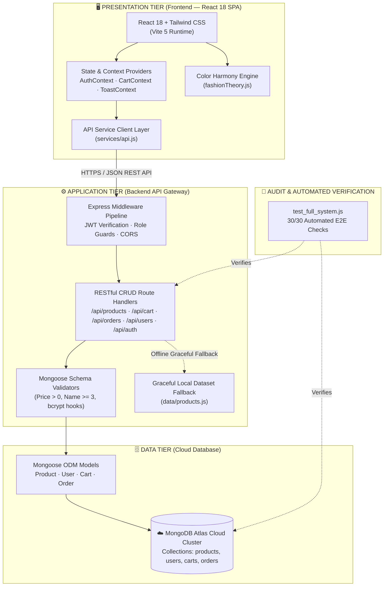

# 🍵 MatchA — Modern Japanese Artisan Streetwear & E-Commerce

> **Full-Stack Minimalist Fashion Platform**  
> React 18 · Vite 5 · Express · MongoDB Atlas · Mongoose · Tailwind CSS v4 · Lenis Smooth Scroll

---

## 🌟 Overview & Highlights

**MatchA** is a premium Japanese streetwear and artisan textile e-commerce web application. Built with high-precision aesthetics and modern full-stack architecture, it combines cutting-edge interactive shopping experiences with robust cloud database pipelines.

### Key Features:
1. **Editorial Magazine Lookbook (Issue No. 04):**
   - Luxury editorial magazine spread layout with **interactive 3D card tilt** and specular glare reflection.
   - **Synchronized Multi-Ring Radar Hotspots:** Click or hover garment pins on lifestyle model photography to instantly highlight the corresponding authentic flatlay garment and trigger 1-click Quick Add to Bag.
   - **Spring Seasonal Filter Pills:** Switch between All Issues, Spring Bloom, Summer Resort, Autumn Earth, and Winter Minimal with staggered entrance animations.
   - **Cinematic Inspection Lightbox:** Fullscreen zoom-lens inspection with keyboard navigation (`←`, `→`, `Esc`).
2. **Mix & Match Studio:**
   - Interactive 4-piece outfit coordinator (Tops, Bottoms, Footwear, Accessories).
   - Real-time mathematical harmony scoring algorithm evaluating tone, contrast, and silhouette balance.
3. **Personal Color Lab:**
   - 4-Season color theory diagnostics (Spring Warm, Summer Cool, Autumn Warm, Winter Cool).
   - Curates custom garment palettes tailored to the customer's natural undertones.
4. **End-to-End E-Commerce Engine:**
   - Unified persistent cart synchronized via `CartContext` and REST API.
   - Multi-step checkout with coupon engine (`MATCHA15`, `WELCOME10`, etc.), shipping method selector, and live order placement into **MongoDB Atlas**.
5. **Admin Management Suite:**
   - Live inventory management, stock adjustments, product creation with strict field validation, and real-time order tracking.

---

## 🏗️ Final System Architecture



### Directory Structure

```text
MatchA/
├── app/                              # Primary Application Repository
│   ├── backend/                      # Express REST API & Database Layer
│   │   ├── config/                   # Database connection configuration
│   │   ├── data/                     # Seed catalog database
│   │   ├── middleware/               # Token verification & role guards
│   │   ├── models/                   # Mongoose schemas (Product, Cart, Order, User)
│   │   ├── seed.js                   # MongoDB Atlas catalogue seeder
│   │   ├── seedUsers.js              # Creates the admin/member sign-in accounts
│   │   ├── .env.example              # Required environment keys (no values)
│   │   └── server.js                 # Express server, auth & REST CRUD endpoints
│   ├── frontend/                     # React Single Page Application (SPA)
│   │   ├── public/
│   │   │   └── images/
│   │   │       ├── location_lifestyle/ # Curated editorial campaign photography
│   │   │       ├── lookbook_flatlay/   # Authentic flatlay garment PNGs
│   │   │       ├── products/           # Catalog apparel photos (600+ items)
│   │   │       └── studio_white_bg/    # Studio fit reference photography
│   │   └── src/
│   │       ├── components/           # Modular UI components (home, layout, catalog, payment, etc.)
│   │       ├── context/              # Global state (CartContext, AuthContext, ToastContext)
│   │       ├── data/                 # Curated editorial spreads & client fallback catalog
│   │       ├── pages/                # Route containers (Home, Lookbook, MixMatch, Catalog, etc.)
│   │       ├── services/             # API client services
│   │       └── utils/                # Personal color theory & image fallback handlers
│   ├── package.json                  # Workspace runner (Concurrently dev server)
│   └── test_full_system.js           # 30-check automated E2E system verification suite
├── docs/                             # Technical specs, architecture docs, color theory guide
└── Requirement/                      # Sprint backlogs, wireframes, ERDs, and design artifacts
```

---

## 🚀 Quick Start

### 1. Prerequisites
- **Node.js**: v18+ or v20+ recommended
- **MongoDB**: Active MongoDB Atlas cluster or local MongoDB instance (configured in `backend/.env`)

### 2. Installation
Install root, backend, and frontend dependencies:
```bash
npm run install:all
```

### 3. Environment Setup
Copy `backend/.env.example` to `backend/.env` and fill it in:
```env
PORT=5000
MONGODB_URI=mongodb+srv://<user>:<password>@<cluster>.mongodb.net/MatchA?retryWrites=true&w=majority

# Signs session tokens — use a long random value, unique per environment
JWT_SECRET=<generate one>

# Credentials for the demo accounts created by `npm run seed:users`
SEED_ADMIN_PASSWORD=<choose one>
SEED_MEMBER_PASSWORD=<choose one>
```

Generate a token secret with:
```bash
node -e "console.log(require('crypto').randomBytes(48).toString('base64url'))"
```

> `backend/.env` is gitignored and must never be committed. `backend/.env.example`
> documents the required keys and carries no values.

### 3.1 Seed the sign-in accounts
```bash
npm run seed --prefix backend        # product catalogue
npm run seed:users --prefix backend  # admin + member accounts (bcrypt hashed)
```

### 4. Run Development Server
Start both Express backend (`:5000`) and Vite frontend (`:5173`) concurrently:
```bash
npm run dev
```

- **Frontend URL:** [http://localhost:5173](http://localhost:5173)
- **Backend API:** [http://localhost:5000/api/health](http://localhost:5000/api/health)
- **Editorial Lookbook:** [http://localhost:5173/lookbook](http://localhost:5173/lookbook)
- **Mix & Match Studio:** [http://localhost:5173/mix-match](http://localhost:5173/mix-match)

---

## 🧪 Testing & Verification

Run the automated full-stack E2E audit suite:
```bash
npm test
```
Runs 30 checks. The suite signs in as the administrator first, then exercises
the protected routes with that token and confirms anonymous callers are refused.

**Verification Scope:**
- Administrator sign-in, rejection of a wrong credential, and refusal of anonymous access to protected routes
- Backend health check & categories API
- Product catalog query filters & pagination
- Strict product validation guardrails (Task 10.3)
- Full Product CRUD & Admin stock updates (Sprint 2 Tasks 6.5–6.8)
- Cart CRUD operations (Add, Quantity update, Delete)
- Order placement & receipt retrieval on MongoDB Atlas
- Member user registration, profile update, and account lifecycle

---

## 🔒 Authentication & Authorization

Sign-in is decided by the server. The browser is told the outcome; it does not
work it out for itself.

| Concern | How it is handled |
| :--- | :--- |
| Passwords | Hashed with bcrypt (10 rounds) in a `pre('save')` hook on the User model, so no route can write a plaintext value by forgetting to |
| Storage | The `password` field is `select: false` and stripped from every response — it is never sent to a client |
| Sessions | A JWT signed with `JWT_SECRET`, valid 7 days, sent as `Authorization: Bearer <token>` |
| Role checks | Read from the database on each request, not from the token, so a demotion takes effect immediately |
| Sign-up | `POST /api/auth/register` never honours a `role` from the request body — nobody registers themselves as an administrator |
| Failed sign-in | One message for an unknown address and a wrong password alike, so responses cannot be used to discover registered emails |

**Protected routes**

| Route | Requires |
| :--- | :--- |
| `POST` `PUT` `DELETE` `/api/products/:id` | Administrator |
| `GET /api/users` · `POST /api/users` | Administrator |
| `GET` `PUT` `DELETE` `/api/users/:id` | Signed in; own account only unless Administrator |
| Everything else (catalogue, cart, orders) | Open |

A member editing their own profile cannot change `role` or `tier`, and cannot
change a password through the profile route.

### Git hygiene
- **`backend/.env`** is gitignored and has never been committed — verified across the full history.
- **`backend/.env.example`** is committed instead, documenting the required keys with no values.
- **Large binary assets (`images/lookbook_flatlay/*`)** are tracked via `.gitkeep` without inflating git history.
- Commits follow conventional commit specifications (`feat:`, `fix:`, `chore:`).

### Known limitations
- Social sign-in buttons are placeholders and are disabled; no OAuth provider is wired up.
- There is no rate limiting on the sign-in route, and no password-reset delivery — the "forgot password" dialog is UI only.
- The admin Orders and Members tables fall back to seeded sample rows when the API returns nothing, so an empty database still demonstrates the layout.
