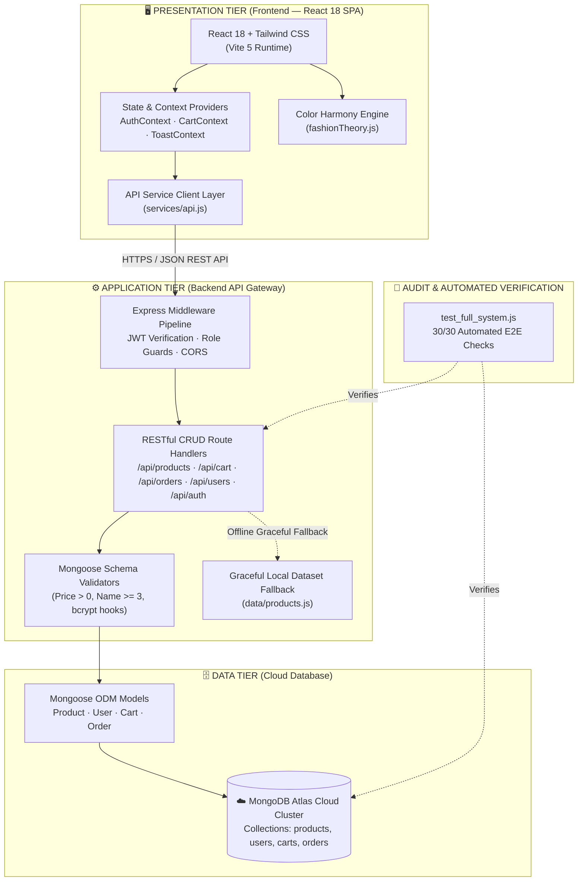

# 🍵 MatchA — Modern Japanese Artisan Streetwear & E-Commerce Platform

[](https://react.dev/)
[](https://vitejs.dev/)
[](https://nodejs.org/)
[](https://expressjs.com/)
[](https://www.mongodb.com/atlas)
[](https://mongoosejs.com/)
[](https://tailwindcss.com/)
[](./test_full_system.js)

> **Full-Stack Engineering Showcase & Developer Portfolio**  
> A premium Japanese artisan streetwear platform combining real-time interactive styling experiences with an enterprise-grade Express.js and MongoDB Atlas REST data pipeline.

---

## 📌 Executive Summary (Read in 2 Minutes)

| Dimension | Details |
| :--- | :--- |
| **Project Type** | Full-Stack E-Commerce & Fashion Tech Web Application |
| **Architecture** | 3-Tier Decoupled Monorepo (React 18 SPA + Express Gateway + MongoDB Atlas) |
| **Frontend Stack** | React 18, Vite 5, Tailwind CSS v4, Context API, Lenis Smooth Scroll |
| **Backend Stack** | Node.js, Express.js, Mongoose ODM, MongoDB Atlas Cloud Database |
| **Security & Auth** | Server-side bcrypt (10 rounds) + 7-Day JWT Bearer tokens + DB Role Guards |
| **Quality Verification** | **30/30 Automated E2E Checks Passing** (`test_full_system.js`), 0 Build Errors |
| **Documentation** | Complete Technical Specs and Proposals available in [`docs/`](./docs/) |

---

## 👨‍💻 My Engineering Contributions

As a core developer on the MatchA platform, I spearheaded both foundational architecture and specialized user-experience systems:

1. **Full-Stack Architecture & API Integration:**
   - Co-architected the decoupled 3-tier monorepo structure separating frontend client and Express REST API gateway.
   - Built the centralized API service layer ([`services/api.js`](./frontend/src/services/api.js)) featuring automatic Bearer JWT attachment and graceful offline fallback handling.

2. **Database Modeling & Validation Guardrails:**
   - Designed MongoDB schemas via Mongoose for **Products, Users, Carts, and Orders** ([`backend/models/`](./backend/models/)).
   - Enforced strict server-level validation (positive pricing, minimum string constraints, enum category taxonomies).

3. **Authentication & Role-Based Authorization:**
   - Engineered server-enforced authentication pipeline with automatic bcrypt password hashing (`pre('save')` hooks) and JWT issuance.
   - Implemented role-based route middleware ([`backend/middleware/auth.js`](./backend/middleware/auth.js)) querying fresh database records to prevent unauthorized product and member tampering.

4. **Interactive Fashion Logic Engines:**
   - **Personal Color Lab:** Implemented 4-season undertone matching algorithms recommending harmonious clothing collections based on color temperature.
   - **Mix & Match Studio:** Developed real-time mathematical silhouette and contrast balance scoring across 4 wearable garment slots.

5. **Automated Testing & Release Verification:**
   - Authored and maintained the **30-test automated full-stack E2E audit suite** ([`test_full_system.js`](./test_full_system.js)), validating the entire pipeline from auth rejection to MongoDB persistence with 100% pass rate.

---

## 🏗️ System Architecture

### 1. High-Level Technical Data Flow (For Technical Interview)

```text
       [ User Web Browser (Client) ]
                     │
                     ▼
       [ React 18 + Tailwind CSS (Vite SPA) ]
                     │
                     ▼
       [ React Router / Global Contexts / Custom Hooks ]
         (AuthContext · CartContext · ToastContext)
                     │
                     ▼
       [ API Service Client Layer (services/api.js) ]
                     │ (HTTPS / JSON · Authorization: Bearer <JWT>)
                     ▼
       [ Express.js REST API Gateway (:5000) ]
         (CORS · JSON Parser · JWT Verification · Role Guards)
                     │
                     ▼
       [ Mongoose ODM Layer (Schemas, Hooks, Validators) ]
         (Product · User · Cart · Order Models)
                     │ (Pooled Connections)
                     ▼
       [ ☁️ MongoDB Atlas Cloud Cluster ]
         (Collections: products, users, carts, orders)
```

### 2. Comprehensive System Architecture Diagram



---

## 🌟 Core Features & User Experiences

### 1. 🎨 Personal Color Lab
- **Concept:** Translates personal color theory into interactive e-commerce merchandising.
- **Diagnostic Engine:** Classifies users across 4 Seasonal Palettes (**Spring Warm, Summer Cool, Autumn Warm, Winter Cool**) and dynamically filters 600+ apparel items matching natural undertones.

### 2. 🥋 Interactive Mix & Match Studio
- **4-Slot Outfit Coordinator:** Allows users to assemble bespoke outfits across Tops, Bottoms, Footwear, and Accessories.
- **Harmony Scoring:** Calculates real-time aesthetic harmony based on complementary color wheel distances and silhouette proportions.
- **1-Click Bundle Add:** Batches all selected outfit pieces into the global cart with single-action execution.

### 3. 📖 Luxury Editorial Lookbook (Issue No. 04)
- **Cinematic Spread:** Editorial lookbook with 3D tilt micro-interactions, spring filter pills, and fullscreen lightbox.
- **Synchronized Radar Hotspots:** Garment pins placed on lifestyle photography synchronize directly with authentic flatlay garment data and instant purchase drawers.

### 4. 🛒 End-to-End E-Commerce & Checkout Engine
- **Persistent Cart:** Synchronized between browser storage and backend database pipelines.
- **Multi-Step Checkout:** Coupon discount engine (`MATCHA15`), dynamic shipping selection, and atomic MongoDB order creation.

### 5. 🛡️ Role-Guarded Admin Console
- **Inventory Operations:** Real-time stock adjustments, product creation with multi-field validation, and order management.
- **Role Enforced:** Strictly restricted to users possessing verified `Admin` privileges.

---

## 🔒 Authentication & Security Architecture

We prioritize strict server-side validation and pragmatic security hygiene:

| Security Concern | Implementation Details |
| :--- | :--- |
| **Password Security** | Bcrypt hashing (10 salt rounds) enforced in Mongoose `pre('save')` hooks. |
| **Credential Storage** | The `password` field is `select: false` on the User model and stripped from every REST response. |
| **Session Authorization** | 7-day JWT tokens sent via `Authorization: Bearer <token>` header. |
| **Role Verification** | Evaluated on every request against the active MongoDB record, preventing stale token privilege escalation. |
| **Route Protection** | Admin-only operations (`POST/PUT/DELETE /api/products`, `GET /api/users`) return `403 Forbidden` for standard members and `401 Unauthorized` for anonymous callers. |
| **Enumeration Defense** | Sign-in endpoint returns identical generic error messages for nonexistent accounts and incorrect passwords. |

> **⚠️ Note on Authentication Scope:**  
> The core email/password authentication, password hashing, JWT session lifecycle, and role guards are **fully implemented on the server**. Third-party social buttons (Google, GitHub) are styled prototype placeholders and disabled in the UI.

---

## 🧪 Automated Verification Suite (30/30 Passed)

The codebase includes an automated full-stack E2E audit suite ([`test_full_system.js`](./test_full_system.js)) that exercises the complete system against live MongoDB Atlas:

```bash
npm test
```

### Audit Coverage Summary:
- **Authentication Pipeline:** Admin login, token issuance, password omission verification, invalid credential rejection (`401`), and anonymous request refusal (`401/403`).
- **Health & Catalog:** Server health check (`/api/health`), category listing, catalog query filtering, and pagination metadata.
- **Product Validation:** Rejection of negative/zero price and short names (`400 Bad Request`), complete product lifecycle (Create, Read, Update, Delete).
- **Cart Operations:** Multi-item cart mutations, quantity updates, user isolation, and item removal.
- **Order Processing:** Order creation, total calculation, shipping assignment, and receipt retrieval.
- **User Lifecycle:** Member registration, profile updates, and role guard verification.

```text
======================================================
📊 Audit Results: 30 PASSED, 0 FAILED (100% Verified)
======================================================
```

---

## 📁 Project Structure

```text
MatchA/
├── backend/                          # Express.js REST API & Database Layer
│   ├── config/                       # Database configuration
│   ├── data/                         # Static fallback datasets (products, categories)
│   ├── middleware/                   # JWT verification & role authorization guards
│   ├── models/                       # Mongoose schemas (Product, User, Cart, Order)
│   ├── seed.js                       # Catalog database seeder
│   ├── seedUsers.js                  # Initial Admin/Member account provisioner
│   ├── .env.example                  # Environment key definitions (no secrets committed)
│   └── server.js                     # Express server & REST API route implementations
├── frontend/                         # React 18 Single Page Application
│   ├── public/images/                # High-resolution campaign & catalog photography
│   └── src/
│       ├── components/               # Domain-specific UI modules (admin, auth, catalog, home, layout)
│       ├── context/                  # Global state (AuthContext, CartContext, ToastContext)
│       ├── data/                     # Curated editorial data & client fallbacks
│       ├── hooks/                    # Custom animation, scroll reveal, and motion hooks
│       ├── pages/                    # Routed views (Home, Lookbook, Studio, Personal Color, Admin)
│       ├── services/                 # Centralized API service layer
│       └── utils/                    # Color harmony algorithms & helper utilities
├── docs/                             # Full technical specifications and architecture docs
├── package.json                      # Root workspace orchestrator (Concurrently dev runner)
└── test_full_system.js               # 30-check automated E2E system verification suite
```

---

## 🚀 Quick Start Guide

### 1. Prerequisites
- **Node.js**: v18.0.0 or higher
- **MongoDB**: Active MongoDB Atlas cluster or local instance

### 2. Installation
Install all dependencies across root, backend, and frontend with a single command:
```bash
npm run install:all
```

### 3. Environment Configuration
Create `backend/.env` from the provided template:
```bash
cp backend/.env.example backend/.env
```

Configure the required variables in `backend/.env`:
```env
PORT=5000
MONGODB_URI=mongodb+srv://<username>:<password>@<cluster>.mongodb.net/MatchA?retryWrites=true&w=majority
JWT_SECRET=your_super_secret_jwt_key_here
SEED_ADMIN_PASSWORD=your_admin_password
SEED_MEMBER_PASSWORD=your_member_password
```
*(Note: `backend/.env` is strictly ignored by `.gitignore` and has never been committed to Git).*

### 4. Database Seeding (Optional)
Seed the catalog products and demo accounts into your MongoDB database:
```bash
npm run seed --prefix backend        # Seeds 600+ product catalog items
npm run seed:users --prefix backend  # Provisions hashed admin & member demo accounts
```

### 5. Run the Application
Launch both Backend (Port 5000) and Frontend (Port 5173) concurrently:
```bash
npm run dev
```

- **Frontend App:** [http://localhost:5173](http://localhost:5173)
- **Backend API Gateway:** [http://localhost:5000/api/health](http://localhost:5000/api/health)
- **Editorial Lookbook:** [http://localhost:5173/lookbook](http://localhost:5173/lookbook)
- **Mix & Match Studio:** [http://localhost:5173/mix-match](http://localhost:5173/mix-match)
- **Personal Color Lab:** [http://localhost:5173/personal-color](http://localhost:5173/personal-color)

---

## 🔮 Engineering Roadmap & Next Steps

- [ ] **Phase 2 Modularization:** Decompose `server.js` route handlers into dedicated Controller-Route folders (`routes/`, `controllers/`).
- [ ] **Payment Sandbox:** Wire Stripe / Omise payment gateway webhooks for asynchronous payment capture.
- [ ] **Redis Caching:** Introduce an in-memory Redis layer for frequently queried seasonal lookbook spreads and category trees.
- [ ] **CI/CD Automation:** Establish GitHub Actions pipeline executing `npm test` and `npm run build` on every pull request.

---

## 📄 License & Attribution

This project is developed for educational and professional demonstration purposes. All photography, garments, and design tokens belong to their respective creators and copyright holders.
