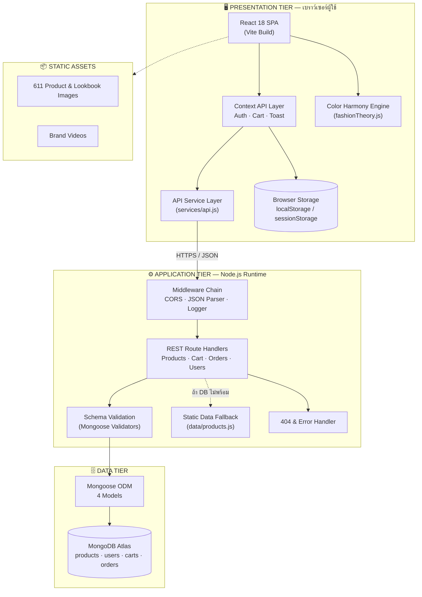
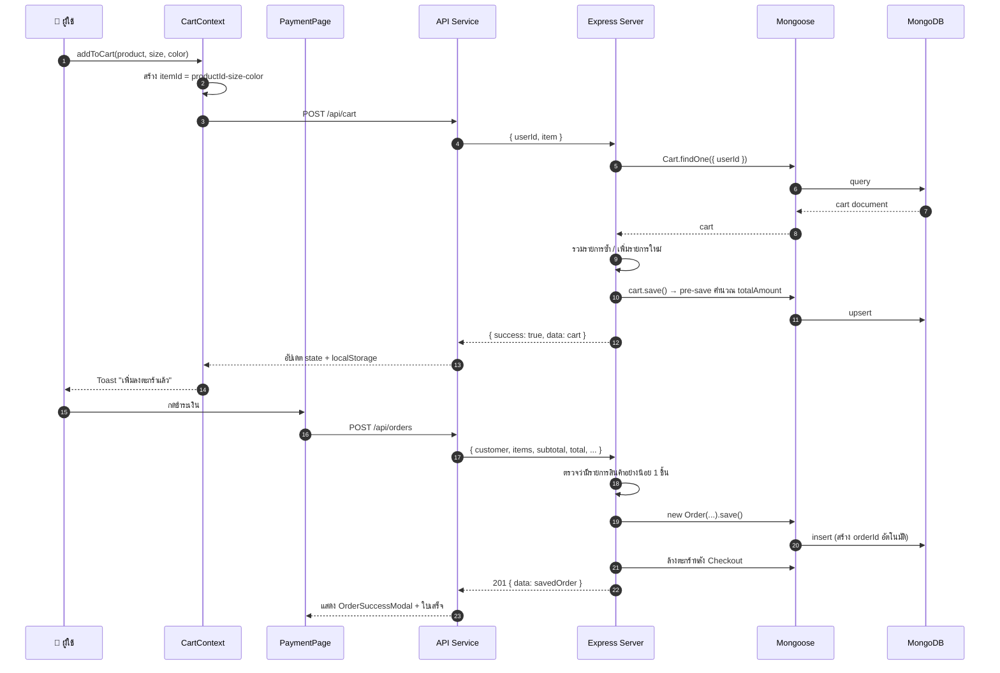
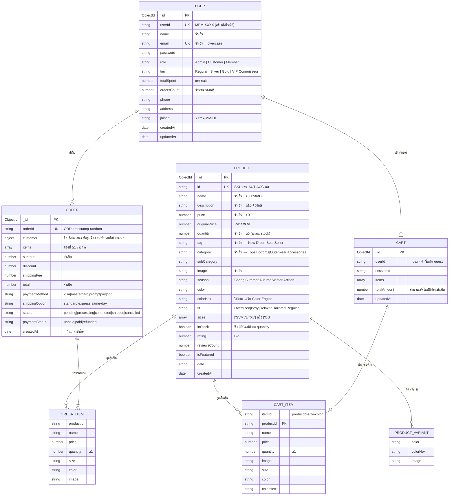

# MatchA — ข้อกำหนดทางเทคนิค (Technical Specification)

> **โครงการ:** MatchA — Personal Color Fashion & Accessories E-Commerce Platform
> **เวอร์ชันเอกสาร:** 1.0 · **วันที่:** 7 กันยายน 2569
> **เอกสารคู่กัน:** [`01-Project-Proposal.md`](./01-Project-Proposal.md) — ข้อเสนอโครงการ
> **รายละเอียดคอมโพเนนต์:** [`03-Component-Reference.md`](./03-Component-Reference.md) — อ้างอิงรายตัวทุกไฟล์ พร้อมกายวิภาคหน้าจอ

---

## สารบัญ

1. [ภาพรวมสถาปัตยกรรมระบบ](#1-ภาพรวมสถาปัตยกรรมระบบ-system-architecture)
2. [Tech Stack](#2-tech-stack)
3. [โครงสร้างโปรเจกต์](#3-โครงสร้างโปรเจกต์-project-structure)
4. [โครงสร้างข้อมูล](#4-โครงสร้างข้อมูล-data-model)
5. [API หลัก](#5-api-หลัก-rest-api-reference)
6. [สถาปัตยกรรมฝั่ง Frontend](#6-สถาปัตยกรรมฝั่ง-frontend)
7. [Color Harmony Engine](#7-color-harmony-engine-หัวใจของระบบ)
8. [Design System](#8-design-system)
9. [ความปลอดภัย](#9-ความปลอดภัย-security)
10. [บริการภายนอกที่ต้องเชื่อมต่อ](#10-บริการภายนอกที่ต้องเชื่อมต่อ-external-services)
11. [ประสิทธิภาพและความทนทานของระบบ](#11-ประสิทธิภาพและความทนทานของระบบ-performance--resilience)
12. [การทดสอบและคุณภาพ](#12-การทดสอบและคุณภาพ-testing--quality)
13. [การติดตั้งและ Deployment](#13-การติดตั้งและ-deployment)
14. [ความเสี่ยงและแผนรับมือ](#14-ความเสี่ยงและแผนรับมือ-risk-register)
15. [แผนขยายระบบในอนาคต](#15-แผนขยายระบบในอนาคต-scalability-roadmap)

---

## 1. ภาพรวมสถาปัตยกรรมระบบ (System Architecture)

### 1.1 รูปแบบสถาปัตยกรรม

MatchA ใช้สถาปัตยกรรม **3-Tier Decoupled Architecture** — Presentation / Application / Data แยกออกจากกันโดยสมบูรณ์ สื่อสารผ่าน REST API เท่านั้น ทำให้แต่ละชั้นพัฒนา ทดสอบ และ deploy ได้อิสระ



### 1.2 หลักการออกแบบ (Design Principles)

| หลักการ | การนำไปใช้ |
| :--- | :--- |
| **Separation of Concerns** | UI Component ไม่เรียก `fetch` เอง — เรียกผ่าน Context หรือ API Service Layer เท่านั้น |
| **Single Source of Truth** | สถานะร่วม (ผู้ใช้, ตะกร้า, การแจ้งเตือน) อยู่ใน React Context ชั้นเดียว |
| **Graceful Degradation** | ถ้าฐานข้อมูลหรือ Proxy ไม่พร้อม ระบบยังแสดงแคตตาล็อกจาก static data ได้ ไม่ขาวทั้งหน้า |
| **Stateless API** | ทุก request มีข้อมูลครบในตัว ไม่พึ่ง server-side session — ขยายเป็นหลาย instance ได้ |
| **Convention over Configuration** | ทุก API response ใช้รูปแบบเดียวกัน `{ success, message, data }` |

### 1.3 Request Lifecycle — ตัวอย่างการสั่งซื้อ



---

## 2. Tech Stack

### 2.1 Frontend

| เทคโนโลยี | เวอร์ชัน | บทบาท |
| :--- | :--- | :--- |
| **React** | 18.2 | UI Library — Function Component + Hooks |
| **Vite** | 5.1 | Build Tool & Dev Server (HMR, ESM) |
| **React Router DOM** | 7.18 | Client-Side Routing (SPA) |
| **Tailwind CSS** | 4.3 | Utility-First CSS + Design Token |
| **PostCSS / Autoprefixer** | 8.5 / 10.5 | CSS Pipeline |
| **Lenis** | 1.3 | Smooth Scroll ระดับ Premium |
| **Lucide React** | 0.344 | Icon Set (Tree-shakable SVG) |

### 2.2 Backend

| เทคโนโลยี | เวอร์ชัน | บทบาท |
| :--- | :--- | :--- |
| **Node.js** | 18+ | JavaScript Runtime |
| **Express** | 4.19 | HTTP Server & Routing |
| **Mongoose** | 9.9 | ODM — Schema, Validation, Virtuals, Hooks |
| **CORS** | 2.8 | Cross-Origin Resource Sharing |
| **dotenv** | 17.4 | Environment Variable Management |

### 2.3 Database & Tooling

| เทคโนโลยี | บทบาท |
| :--- | :--- |
| **MongoDB Atlas** | ฐานข้อมูล NoSQL แบบ Managed Cloud |
| **concurrently** | รัน frontend + backend พร้อมกันในคำสั่งเดียว |
| **Node `--watch`** | Hot Reload ฝั่งเซิร์ฟเวอร์ (ไม่ต้องพึ่ง nodemon) |

### 2.4 เหตุผลที่เลือก Stack นี้

| การตัดสินใจ | เหตุผล |
| :--- | :--- |
| **React + Vite** แทน Next.js | โปรเจกต์เป็น SPA ที่มีอินเทอร์แอกชันหนัก (Mix & Match, Color Swatch) ไม่ต้องพึ่ง SSR — Vite ให้ Dev Experience เร็วกว่ามาก และ Bundle เล็กกว่า |
| **MongoDB** แทน PostgreSQL | สินค้าแฟชั่นมีโครงสร้างไม่คงที่ — จำนวน variant, ไซส์, สี ต่างกันทุกชิ้น Document Model จึงเหมาะกว่าตารางที่ต้อง JOIN หลายชั้น |
| **Context API** แทน Redux | สถานะร่วมมีแค่ 3 domain (Auth, Cart, Toast) — Redux จะเป็นการเพิ่ม boilerplate โดยไม่ได้ประโยชน์ |
| **Tailwind v4** | Design Token กำหนดใน CSS เดียว ทำให้พาเลตต์ Personal Color เปลี่ยนได้จากจุดเดียว |
| **Mongoose Virtuals** | ทำ alias `stock` ↔ `quantity` เพื่อให้ฟอร์ม Admin และ API ใช้ชื่อฟิลด์ที่คุ้นเคยได้ทั้งคู่โดยไม่ต้องแปลงข้อมูล |

---

## 3. โครงสร้างโปรเจกต์ (Project Structure)

```
MatchA/
├── app/
│   ├── package.json                    # Workspace root — script รวม
│   ├── test_full_system.js             # E2E Test Suite
│   │
│   ├── backend/
│   │   ├── server.js                   # Express App + 21 Route Handlers (816 บรรทัด)
│   │   ├── seed.js                     # Script นำเข้าข้อมูลตั้งต้น
│   │   ├── data/products.js            # Static Data Fallback (60 รายการ)
│   │   └── models/
│   │       ├── Product.js              # Schema สินค้า + Variant + Virtual + Hook
│   │       ├── User.js                 # Schema ผู้ใช้ + Role + Tier
│   │       ├── Cart.js                 # Schema ตะกร้า + คำนวณยอดอัตโนมัติ
│   │       └── Order.js                # Schema คำสั่งซื้อ + OrderItem
│   │
│   └── frontend/
│       ├── vite.config.js              # Dev Proxy → backend :5000
│       ├── tailwind.config.js          # Design Token
│       ├── vercel.json                 # SPA Rewrite Rule
│       ├── public/
│       │   ├── images/                 # 611 ไฟล์ภาพ (products / lifestyle / studio)
│       │   └── videos/
│       └── src/
│           ├── main.jsx                # Entry Point + BrowserRouter
│           ├── App.jsx                 # Route Table + Provider Tree + Lenis
│           ├── index.css               # Design Token & Global Style
│           │
│           ├── context/                # 🧠 State Layer
│           │   ├── AuthContext.jsx     #    ผู้ใช้ + การเข้าสู่ระบบ
│           │   ├── CartContext.jsx     #    ตะกร้า + การคำนวณยอด
│           │   ├── ToastContext.jsx    #    การแจ้งเตือน
│           │   └── index.js            #    Barrel Export
│           │
│           ├── services/
│           │   └── api.js              # 🔌 API Client + Fallback Logic
│           │
│           ├── utils/
│           │   ├── fashionTheory.js    # 🎨 Color Harmony Engine
│           │   └── imageFallback.js    #    จัดการภาพเสีย
│           │
│           ├── data/
│           │   ├── productsData.js     # ข้อมูลสินค้าฝั่ง Client
│           │   └── lifestyleEditorialData.js
│           │
│           ├── pages/                  # 📄 12 หน้า
│           │   ├── HomePage.jsx
│           │   ├── CatalogPage.jsx
│           │   ├── PersonalColorPage.jsx
│           │   ├── MixMatchStudioPage.jsx
│           │   ├── EditorialLookbookPage.jsx
│           │   ├── CartPage.jsx
│           │   ├── PaymentPage.jsx  /  Payment.jsx
│           │   ├── LoginPage.jsx  /  SignUpPage.jsx
│           │   ├── UserAccount.jsx
│           │   └── AdminPage.jsx       # 1,367 บรรทัด — 6 แท็บ
│           │
│           └── components/             # 🧩 38 Component แยกตามโดเมน
│               ├── layout/             #    Navbar · Footer · Layout
│               ├── home/               #    BrandHero · StreetFavorites · ChooseYourFit …
│               ├── catalog/            #    ProductCard · QuickView · FilterDrawer · Toolbar · Pagination
│               ├── product/            #    ProductCard · ProductModal
│               ├── cart/               #    CartDrawer
│               ├── payment/            #    ShippingStep · PaymentMethodStep · OrderSummarySidebar · OrderSuccessModal
│               ├── account/            #    7 Tab Component
│               ├── auth/               #    AuthModal · SignUpForm
│               ├── admin/              #    AddProductModal
│               └── ui/                 #    SpotlightCard · BorderBeam · EmptyState · Skeleton · ScrollProgressTracker
│                                       #    → รายละเอียดทุกตัวใน docs/03-Component-Reference.md
│
├── docs/
│   ├── 01-Project-Proposal.md          # ← ข้อเสนอโครงการ
│   ├── 02-Technical-Spec.md            # ← เอกสารฉบับนี้
│   ├── 03-Component-Reference.md       # ← อ้างอิงคอมโพเนนต์รายตัว
│   ├── personal-color-theory.md
│   └── diagrams/                       # ไดอะแกรม HTML แบบโต้ตอบได้
│
└── Requirement/                        # SRS, Backlog, Excalidraw, ERD, Wireframes
```

---

## 4. โครงสร้างข้อมูล (Data Model)

### 4.1 Entity Relationship Diagram



### 4.2 กลไกอัตโนมัติใน Schema

ระบบใช้ความสามารถของ Mongoose เพื่อลดโค้ดซ้ำและกันข้อมูลไม่สอดคล้อง:

| Model | กลไก | ผลลัพธ์ |
| :--- | :--- | :--- |
| **Product** | Virtual `stock` ↔ `quantity` | ฟอร์ม Admin ส่ง `stock` มาได้ ระบบเก็บลง `quantity` ให้เอง |
| **Product** | `pre('save')` | ตั้ง `inStock = quantity > 0` อัตโนมัติ และเติม `id` จาก `_id` ถ้าไม่ได้ระบุ |
| **Product** | `originalPrice` default function | ถ้าไม่ระบุ ใช้ค่าเท่ากับ `price` |
| **Cart** | `pre('save')` | คำนวณ `totalAmount` จากรายการทั้งหมดทุกครั้งที่บันทึก — ยอดรวมไม่มีทางเพี้ยน |
| **User** | `pre('save')` | สร้างรหัสสมาชิก `MEM-XXXX` จาก `_id` |
| **Order** | `orderId` default function | สร้างเลขออเดอร์ `ORD-{timestamp}-{random}` ที่ไม่ซ้ำกัน |
| **Order** | Custom validator บน `items` | ปฏิเสธออเดอร์ที่ไม่มีสินค้าตั้งแต่ระดับ Schema |
| ทุก Model | `mongoose.models.X \|\| mongoose.model(...)` | กัน error `OverwriteModelError` ตอน Hot Reload |

### 4.3 กฎการตรวจสอบข้อมูล (Validation Rules)

ข้อความแจ้งเตือนเขียนเป็นภาษาไทยในระดับ Schema ทำให้ error ที่ส่งกลับไปหน้าเว็บสื่อความหมายทันทีโดยไม่ต้องแปลซ้ำ

| ฟิลด์ | กฎ | ข้อความแจ้งเตือน |
| :--- | :--- | :--- |
| `Product.name` | จำเป็น · อย่างน้อย 3 ตัวอักษร | "ชื่อสินค้าต้องมีความยาวอย่างน้อย 3 ตัวอักษร" |
| `Product.description` | จำเป็น · อย่างน้อย 10 ตัวอักษร | "คำอธิบายต้องมีความยาวอย่างน้อย 10 ตัวอักษร" |
| `Product.price` | จำเป็น · มากกว่า 0 | "ราคาต้องเป็นตัวเลขที่มากกว่า 0" |
| `Product.quantity` | จำเป็น · ตั้งแต่ 0 ขึ้นไป | "จำนวนสต็อกต้องเป็นจำนวนเต็มตั้งแต่ 0 ขึ้นไป" |
| `Product.tag` | จำเป็น | "กรุณาระบุ Tag หรือประเภทสินค้า" |
| `Product.category` | จำเป็น | "กรุณาเลือกหมวดหมู่สินค้า" |
| `Product.image` | จำเป็น | "รูปภาพสินค้าจำเป็นต้องมี" |
| `User.name` | จำเป็น | "กรุณาระบุชื่อผู้ใช้งาน" |
| `User.email` | จำเป็น · unique · lowercase | "กรุณาระบุอีเมล" |
| `Order.items` | ต้องมีอย่างน้อย 1 รายการ | "รายการสินค้าต้องมีอย่างน้อย 1 รายการ" |

การตรวจสอบทำ **2 ชั้น** — ฝั่ง Client ตรวจก่อนส่ง (ให้ผู้ใช้เห็นทันที) และฝั่ง Server ตรวจซ้ำผ่าน Mongoose (`runValidators: true` แม้ตอน update)

### 4.4 สถิติข้อมูลตั้งต้น

| มิติ | รายละเอียด |
| :--- | :--- |
| จำนวนสินค้า | 60 รายการ |
| จำนวนตัวเลือกสี (Variant) | 211 รายการ |
| แยกตามฤดู | Spring 12 · Summer 12 · Autumn 12 · Winter 12 · Artisan 12 |
| แยกตามหมวดหมู่ | Tops 24 · Bottoms 16 · Accessories 16 · Outerwear 4 |
| หมวดหมู่ย่อย | ~40 ประเภท (Jeans, Sneakers, Bags, Cardigans, Scarves …) |
| ไฟล์ภาพ | 611 ไฟล์ (products / location_lifestyle / studio_white_bg) |

---

## 5. API หลัก (REST API Reference)

**Base URL (dev):** `http://localhost:5000` · **Proxy ฝั่ง Vite:** `/api/*`

รวม **21 route handler** ครอบคลุม **29 path** (บาง endpoint รองรับหลาย path เพื่อความยืดหยุ่นในการเรียกใช้)

### 5.1 รูปแบบ Response มาตรฐาน

ทุก endpoint ตอบกลับด้วยโครงสร้างเดียวกัน — ฝั่ง Client จึงเขียนตัวจัดการเพียงชุดเดียว

```jsonc
// สำเร็จ
{ "success": true, "message": "…", "data": { /* หรือ [] */ } }

// สำเร็จ พร้อมการแบ่งหน้า
{ "success": true, "data": [ … ], "pagination": { "page": 1, "limit": 24, "total": 60, "totalPages": 3 } }

// ผิดพลาด
{ "success": false, "message": "คำอธิบายที่อ่านเข้าใจได้", "error": "รายละเอียดเชิงเทคนิค" }
```

**HTTP Status ที่ใช้:** `200` สำเร็จ · `201` สร้างสำเร็จ · `400` ข้อมูลไม่ถูกต้อง · `404` ไม่พบ · `500` ข้อผิดพลาดเซิร์ฟเวอร์

### 5.2 System

| Method | Path | คำอธิบาย |
| :--- | :--- | :--- |
| `GET` | `/` | ข้อมูลเซิร์ฟเวอร์และรายการ endpoint ที่ใช้ได้ |
| `GET` | `/api/health`, `/health` | ตรวจสถานะระบบ — คืน `status`, `uptime`, `timestamp` และสถานะการเชื่อมต่อฐานข้อมูล |
| `GET` | `/api/items` | ข้อมูลตัวอย่างสำหรับทดสอบการเชื่อมต่อ |

### 5.3 Products

| Method | Path | คำอธิบาย |
| :--- | :--- | :--- |
| `GET` | `/api/categories` | รายการหมวดหมู่พร้อมจำนวนสินค้าในแต่ละหมวด (ใช้ MongoDB Aggregation) |
| `GET` | `/api/products`<br/>`/api/admin/products` | แคตตาล็อก — รองรับการกรอง เรียงลำดับ ค้นหา และแบ่งหน้า |
| `GET` | `/api/products/:id` | รายละเอียดสินค้าชิ้นเดียว (ค้นได้ทั้ง `_id` และ SKU) |
| `POST` | `/api/products`<br/>`/api/admin/products` | เพิ่มสินค้าใหม่ → `201` |
| `PUT` | `/api/products/:id`<br/>`/api/admin/products/:id` | แก้ไขสินค้า / ปรับสต็อก (ตรวจสอบ validator ซ้ำ) |
| `DELETE` | `/api/products/:id`<br/>`/api/admin/products/:id` | ลบสินค้า |

#### Query Parameters ของ `GET /api/products`

| พารามิเตอร์ | ชนิด | ค่าเริ่มต้น | คำอธิบาย |
| :--- | :--- | :--- | :--- |
| `category` | string | `ALL` | Tops · Bottoms · Outerwear · Accessories |
| `season` | string | `ALL` | Spring · Summer · Autumn · Winter · Artisan |
| `color` | string | — | ชื่อสี |
| `fit` | string | — | Oversized · Boxy · Relaxed · Tailored · Regular |
| `search` | string | — | ค้นหาพร้อมกันใน ชื่อ · SKU · คำอธิบาย · สี · แท็ก |
| `sort` | string | `featured` | `featured` · `price-asc` · `price-desc` · `newest` |
| `minPrice` / `maxPrice` | number | 0 / 1000 | ช่วงราคา |
| `inStockOnly` | boolean | `false` | แสดงเฉพาะสินค้าที่มีสต็อก |
| `page` | number | 1 | หน้าที่ต้องการ |
| `limit` | number | 24 | จำนวนต่อหน้า |

**ตัวอย่าง**

```http
GET /api/products?category=Tops&season=Autumn&fit=Oversized&minPrice=30&maxPrice=80&sort=price-asc&page=1&limit=24
```

```jsonc
// POST /api/products — payload
{
  "name": "MatchA Boxy Heavyweight Tee",
  "description": "Heavyweight organic cotton tee in olive tea-dye shade.",
  "price": 42.00,
  "quantity": 30,
  "tag": "New Drop",
  "category": "Tops",
  "season": "Autumn",
  "color": "Matcha Olive",
  "colorHex": "#556B2F",
  "fit": "Boxy",
  "sizes": ["S", "M", "L", "XL"],
  "image": "/images/products/autumn/tops/tees/color_1_olive.jpeg"
}
```

### 5.4 Cart

| Method | Path | คำอธิบาย |
| :--- | :--- | :--- |
| `GET` | `/api/cart?userId=…`<br/>`/api/cart/:userId` | ดึงตะกร้าของผู้ใช้ (ถ้ายังไม่มี คืนตะกร้าว่าง ไม่ error) |
| `POST` | `/api/cart` | เพิ่มสินค้า — ถ้า `itemId` ซ้ำจะบวกจำนวนแทนการเพิ่มแถวใหม่ |
| `PUT` | `/api/cart/:itemId`<br/>`/api/cart/:userId/:itemId` | ปรับจำนวนสินค้าในตะกร้า |
| `DELETE` | `/api/cart/:itemId`<br/>`/api/cart/:userId/:itemId` | ลบสินค้าออกจากตะกร้า |

> **กลไก itemId:** ประกอบขึ้นจาก `productId-size-color` — เสื้อตัวเดียวกันคนละไซส์หรือคนละสีจึงเป็นคนละรายการในตะกร้า ตรงกับพฤติกรรมที่ผู้ใช้คาดหวัง

### 5.5 Orders

| Method | Path | คำอธิบาย |
| :--- | :--- | :--- |
| `POST` | `/api/orders` | สร้างคำสั่งซื้อ → `201` · สร้างเลขออเดอร์อัตโนมัติ · ล้างตะกร้าให้หลัง Checkout |
| `GET` | `/api/orders` | รายการคำสั่งซื้อ 50 รายการล่าสุด เรียงจากใหม่ไปเก่า |
| `GET` | `/api/orders/:id` | รายละเอียดคำสั่งซื้อ (ค้นได้ทั้ง `_id` และ `orderId`) |

```jsonc
// POST /api/orders — payload
{
  "customer": {
    "firstName": "Pee", "lastName": "S.",
    "email": "pee@example.com", "phone": "0812345678",
    "address": "123 Sukhumvit", "city": "Bangkok",
    "zipCode": "10110", "country": "Thailand"
  },
  "items": [
    { "productId": "AUT-TOP-004", "name": "Boxy Heavyweight Tee",
      "price": 42.00, "quantity": 2, "size": "L", "color": "Matcha Olive" }
  ],
  "subtotal": 84.00,
  "discount": 0,
  "shippingFee": 0,
  "total": 84.00,
  "paymentMethod": "promptpay",
  "shippingOption": "standard"
}
```

### 5.6 Users

| Method | Path | คำอธิบาย |
| :--- | :--- | :--- |
| `GET` | `/api/users` | รายชื่อสมาชิกทั้งหมด (ใช้ใน VIP Registry) |
| `GET` | `/api/users/:id` | ข้อมูลสมาชิก — ค้นได้ทั้ง `_id`, `userId` และอีเมล |
| `POST` | `/api/users` | สมัครสมาชิก — ตรวจอีเมลซ้ำก่อน → `201` |
| `PUT` | `/api/users/:id` | แก้ไขโปรไฟล์ หรือปรับระดับสมาชิก |
| `DELETE` | `/api/users/:id` | ลบสมาชิก |

### 5.7 การจัดการข้อผิดพลาด

| กลไก | พฤติกรรม |
| :--- | :--- |
| **404 Handler** | คืน JSON พร้อม **รายชื่อ endpoint ที่ใช้ได้** ช่วยให้ผู้เรียก API แก้ปัญหาได้เอง |
| **Global Error Handler** | ดักทุก exception ที่หลุดออกมา — คืน `500` รูปแบบเดียวกันเสมอ ไม่มี HTML stack trace หลุดออกไป |
| **Request Logger** | บันทึกทุก request พร้อม timestamp, method, path และ origin |
| **DNS Resolver Fix** | ตั้ง DNS เป็น `8.8.8.8` / `1.1.1.1` เพื่อแก้ปัญหา SRV lookup ของ MongoDB Atlas บน Windows |
| **Non-blocking DB Connect** | ถ้าเชื่อมฐานข้อมูลไม่ได้ เซิร์ฟเวอร์ยังขึ้นและให้บริการ endpoint ที่มี fallback ได้ |

---

## 6. สถาปัตยกรรมฝั่ง Frontend

### 6.1 ตารางเส้นทาง (Route Table)

| Path | Component | สิทธิ์ | หน้าที่ |
| :--- | :--- | :--- | :--- |
| `/` | `HomePage` | สาธารณะ | Hero Lookbook 4 ฤดู, Street Favorites, Choose Your Fit, Brand Loop, Video |
| `/catalog` | `CatalogPage` | สาธารณะ | แคตตาล็อกพร้อมตัวกรอง 6 มิติ + เรียงลำดับ + แบ่งหน้า |
| `/personal-color` | `PersonalColorPage` | สาธารณะ | แบบทดสอบหาฤดูสี + พาเลตต์ส่วนตัว |
| `/mix-match` | `MixMatchStudioPage` | สาธารณะ | Mix & Match Studio + Synergy Score |
| `/lookbook`, `/editorial` | `EditorialLookbookPage` | สาธารณะ | คอนเทนต์ไกด์การแต่งตัว |
| `/cart` | `CartPage` | สาธารณะ | ตะกร้าแบบเต็มหน้า |
| `/payment` | `Payment` | ต้องมีสินค้าในตะกร้า | Checkout หลายขั้นตอน |
| `/login` | `LoginPage` | Guest | เข้าสู่ระบบ |
| `/signup` | `SignUpPage` | Guest | สมัครสมาชิก |
| `/account` | `UserAccount` | สมาชิก | Member Lounge 7 แท็บ |
| `/admin` | `AdminPage` | Admin | Command Center 6 แท็บ |
| `*` | → `/` | — | Redirect เส้นทางที่ไม่รู้จัก |

### 6.2 ชั้นการจัดการสถานะ (State Layer)

```
App.jsx
└── ToastProvider          ← ชั้นนอกสุด (Auth เรียกใช้ Toast ได้)
    └── AuthProvider       ← ข้อมูลผู้ใช้ + การเข้าสู่ระบบ
        └── CartProvider   ← ตะกร้า (ผูกกับผู้ใช้ผ่าน getCartKey)
            └── Layout → Routes → Pages
```

| Context | Hook | ถูกเรียกใช้ใน | ความรับผิดชอบ |
| :--- | :--- | :---: | :--- |
| **ToastContext** | `useToast()` | 14 จุด | คิวการแจ้งเตือน, ประเภท success/error, ปิดอัตโนมัติ |
| **AuthContext** | `useAuth()` | 8 จุด | ข้อมูลผู้ใช้, เข้าสู่ระบบ/ออกจากระบบ, แก้ไขโปรไฟล์, ตัวเลือก "จดจำฉัน" |
| **CartContext** | `useCart()` | 10 จุด | เพิ่ม/ปรับ/ลบสินค้า, คำนวณยอด, แยกตะกร้าตามผู้ใช้, ซิงก์กับ Storage |

> **การเลือก Storage:** เลือก "จดจำฉัน" → เก็บใน `localStorage` (อยู่ข้ามการปิดเบราว์เซอร์) · ไม่เลือก → `sessionStorage` (หายเมื่อปิดแท็บ) ทั้งสองเส้นทางมี `try/catch` ครอบ กันกรณีเบราว์เซอร์ปิดการเก็บข้อมูล

### 6.3 ชั้นบริการ API (API Service Layer)

`services/api.js` เป็นจุดเดียวที่ติดต่อ Backend — Component ไม่เรียก `fetch` โดยตรง ทำให้เปลี่ยน endpoint หรือเพิ่ม header ทำได้จากไฟล์เดียว

**กลไก Dual-Path Fallback**

```
1. เรียกผ่าน Vite Proxy → /api/*          (เส้นทางปกติ)
        │ ถ้าเป็น network error เท่านั้น
        ▼
2. เรียกตรงไปที่ Backend → :5000/api/*     (เส้นทางสำรอง)
        │ ถ้ายังไม่สำเร็จ
        ▼
3. โยน Error ที่สื่อความหมายให้ UI แสดงสถานะ Error พร้อมปุ่ม Retry
```

จุดสำคัญคือ error ระดับ business (เช่น `400 ข้อมูลไม่ถูกต้อง`) จะถูกโยนต่อทันทีโดยไม่ retry — retry เฉพาะกรณีที่เชื่อมต่อไม่ได้จริง ๆ เท่านั้น

### 6.4 ลำดับชั้นของ Component

| ชั้น | ตัวอย่าง | หน้าที่ |
| :--- | :--- | :--- |
| **Page (Smart Container)** | `CatalogPage`, `AdminPage` | ดึงข้อมูล, จัดการสถานะของหน้า, ส่ง props ลงไป |
| **Feature Component** | `ProductCard`, `CartDrawer`, `AddProductModal` | ตรรกะเฉพาะโดเมน |
| **Layout Component** | `Layout`, `Navbar`, `Footer` | โครงร่างที่ใช้ร่วมทุกหน้า |
| **UI Primitive** | `SpotlightCard`, `BorderBeam`, `EmptyState`, `ProductCardSkeleton` | ชิ้นส่วนที่ใช้ซ้ำได้ ไม่ผูกกับโดเมน |

---

## 7. Color Harmony Engine (หัวใจของระบบ)

ไฟล์: [`app/frontend/src/utils/fashionTheory.js`](../app/frontend/src/utils/fashionTheory.js) — 371 บรรทัด · 8 ฟังก์ชันที่ export

นี่คือส่วนที่ทำให้ MatchA ไม่ใช่แค่ร้านค้าออนไลน์ทั่วไป — เป็นเอนจินคำนวณความเข้ากันของชุดที่อ้างอิงทฤษฎีสีเชิงวิชาการจริง

### 7.1 ฐานทฤษฎีที่ใช้

| ทฤษฎี | การนำมาใช้ |
| :--- | :--- |
| **Classical Color Harmony** | จำแนก Monochromatic / Analogous / Complementary + กฎสัดส่วน 60-30-10 |
| **Johannes Itten's 7 Contrasts** (Bauhaus) | ตรวจจับ Light-Dark, Cold-Warm, Saturation, Extension |
| **CIELAB Color Space & Delta E** | วัด "ระยะห่างของสี" ตามการรับรู้ของสายตามนุษย์ — แม่นกว่าการเทียบ RGB ตรง ๆ |
| **Munsell Color System** | อ้างอิงมิติ Hue / Value / Chroma |
| **Modular Wardrobe Combinatorics** | คำนวณความเข้ากันของทรงเสื้อผ้าตามกฎ Rule of Thirds |

### 7.2 ฟังก์ชันหลัก

| ฟังก์ชัน | หน้าที่ |
| :--- | :--- |
| `hexToRgb(hex)` | แปลง HEX → RGB (รองรับทั้ง 3 และ 6 หลัก พร้อมค่า fallback) |
| `rgbToHsl(r,g,b)` | แปลง RGB → HSL สำหรับวิเคราะห์ Hue และ Saturation |
| `rgbToLab(r,g,b)` | แปลง RGB → CIELAB สำหรับคำนวณระยะห่างเชิงการรับรู้ |
| `calculateDeltaE(hex1,hex2)` | คำนวณ Delta E ระหว่างสองสี |
| `getColorTemperature(hue)` | จำแนกอุณหภูมิสี Warm / Cool / Neutral |
| `classifyColorHarmony(hexList)` | ระบุประเภทความกลมกลืนของชุดสี |
| `analyzeIttenContrasts(items)` | ตรวจจับคอนทราสต์ตามทฤษฎี Itten ที่ปรากฏในชุด |
| `computeOutfitSynergy(top,bottom,shoes,acc)` | **ฟังก์ชันหลัก** — รวมทุกอย่างเป็นคะแนนเดียว |

### 7.3 สูตรคำนวณ Synergy Score

```
Synergy Score = Seasonal(35) + Harmony(30) + Contrast(20) + Silhouette(15)
```

| องค์ประกอบ | คะแนนเต็ม | เกณฑ์ |
| :--- | :---: | :--- |
| **A. Seasonal Synergy** | 35 | ฤดูเดียวกันทั้งชุด = 35 · อันเดอร์โทนเดียวกัน = 31 · ข้ามฤดู = 25 |
| **B. Color Harmony & Delta E** | 30 | คะแนนฐาน 18 + โบนัสตามประเภท Harmony พร้อมคำนวณ Delta E ระหว่างท่อนบน-ท่อนล่าง |
| **C. Itten Contrast** | 20 | คะแนนฐาน 14 · +4 ถ้าพบ Light-Dark Contrast · +2 ถ้าพบ Cold-Warm Contrast |
| **D. Silhouette Balance** | 15 | คะแนนฐาน 12 · เพิ่มเมื่อจับคู่ทรงตามกฎ Rule of Thirds (เช่น Oversized/Boxy ท่อนบน + Tailored/Relaxed ท่อนล่าง) |

### 7.4 ผลลัพธ์ที่ส่งกลับ

```jsonc
{
  "score": 92,
  "harmonyType": "Analogous Earth Tone",
  "harmonyDescription": "คำอธิบายประเภทความกลมกลืน",
  "undertoneStatus": "Harmonious Autumn Head-to-Toe Capsule (100% Match)",
  "dominantSeason": "Autumn",
  "proportion60_30_10": { /* สัดส่วนสีหลัก-รอง-เน้น */ },
  "ittenContrasts": [ { "id": "light-dark", "name": "…", "description": "…" } ],
  "deltaE": 34,
  "stylingAdvice": "คำแนะนำการแต่งตัวเป็นภาษาไทย"
}
```

ผลลัพธ์ไม่ได้ให้แค่ตัวเลข — ให้ **เหตุผล** ที่ผู้ใช้อ่านเข้าใจ ซึ่งเป็นสิ่งที่สร้างความไว้วางใจและทำให้ผู้ใช้กล้าตัดสินใจซื้อทั้งเซ็ต

### 7.5 โปรไฟล์ Personal Color

`PersonalColorPage` เก็บโปรไฟล์ครบ 4 ฤดู แต่ละฤดูประกอบด้วย:

| ข้อมูล | ตัวอย่าง (Spring) |
| :--- | :--- |
| ชื่อไทย | ฤดูใบไม้ผลิ (Warm & Bright) |
| Undertone | Warm Undertone (โทนอุ่น) |
| คำอธิบาย | ผิวโทนสว่างอมเหลือง มีความสดใส มีเลือดฝาด… |
| ลักษณะสังเกต | เส้นเลือดข้อมือเห็นเป็นสีเขียว · ใส่ทองขึ้นกว่าเงิน · ออกแดดแล้วเป็นสีแทนทอง |
| พาเลตต์แนะนำ (6 สี) | Peach Coral `#FF7F50` · Warm Cream `#FFFDD0` · Matcha Sage `#8F9779` · Honey Mustard `#E1AD01` · Soft Turquoise `#40E0D0` · Salmon Pink `#FA8072` |
| สีที่ควรเลี่ยง | ดำสนิท · เทาหม่นเข้ม · ม่วงเข้ม |
| ผ้าที่แนะนำ | ลินินธรรมชาติ · ไหมสัมผัสนุ่ม · คอตตอนโปร่งเบา |

---

## 8. Design System

### 8.1 Design Token

```css
/* Personal Color & MatchA Palette Tokens */
--color-spring-warm:  #E29578;   /* Spring Warm — Coral & Peach */
--color-summer-cool:  #83C5BE;   /* Summer Cool — Soft Sage & Sky */
--color-autumn-warm:  #556B2F;   /* Autumn Warm — Olive & Matcha Earth */
--color-winter-cool:  #1A365D;   /* Winter Cool — Deep Cobalt & Charcoal */
--color-brand-canvas: #FAF8F5;   /* พื้นหลังหลัก */
--color-brand-earth:  #2D231E;   /* ตัวอักษรและพื้นผิวคอนทราสต์ */
--color-brand-border: #D9D3C7;   /* เส้นขอบโครงสร้าง */
```

### 8.2 แนวทางการยกระดับพื้นผิว (Surface Elevation)

| ชั้น | สไตล์ |
| :--- | :--- |
| **Canvas** | พื้นหลังหลักของหน้า |
| **Card / Surface** | พื้นขาว + เส้นขอบบาง + เงาอ่อน + มุมโค้ง |
| **Elevated (Modal / Popover)** | เงาเข้มขึ้น + เส้นขอบชัดขึ้น |
| **Interaction** | ทุกปุ่มมี `hover` · `active:scale-[0.98]` · `transition duration-150` |

### 8.3 องค์ประกอบทางภาพ

| องค์ประกอบ | การใช้งาน |
| :--- | :--- |
| `SpotlightCard` | เอฟเฟกต์ไฟส่องตามเมาส์บนการ์ดสินค้า |
| `BorderBeam` | เส้นขอบเคลื่อนไหวเน้นองค์ประกอบสำคัญ |
| `ScrollProgressTracker` | แถบแสดงความคืบหน้าการเลื่อนหน้า |
| **Lenis Smooth Scroll** | การเลื่อนหน้าแบบนุ่มนวลระดับเว็บไซต์แฟชั่นชั้นนำ |
| `ProductCardSkeleton` | Skeleton ที่มีสัดส่วนตรงกับการ์ดจริง |
| `EmptyState` | กรอบเส้นประ + ไอคอน + CTA |

---

## 9. ความปลอดภัย (Security)

### 9.1 มาตรการที่ระบบมีอยู่แล้ว

| ด้าน | การป้องกัน |
| :--- | :--- |
| **การตรวจสอบข้อมูลนำเข้า** | ตรวจสอบ 2 ชั้น (Client + Mongoose Validator) · บังคับ `runValidators` แม้ตอน update |
| **การป้องกัน NoSQL Injection** | ใช้ Mongoose Query Builder ทั้งหมด ไม่มีการต่อ query string เอง · แปลงชนิดข้อมูลด้วย `parseInt` / `parseFloat` ก่อนใช้ |
| **การจัดการความลับ** | ค่าเชื่อมต่อฐานข้อมูลอ่านจาก environment variable ผ่าน `dotenv` ไม่ฝังในโค้ด |
| **การป้องกันอีเมลซ้ำ** | ตรวจสอบก่อนสร้างผู้ใช้ + บังคับ unique index ที่ระดับ Schema |
| **การจัดการ Error** | Global Error Handler คืน JSON รูปแบบเดียว ไม่ปล่อย stack trace เป็น HTML ออกไป |
| **การป้องกัน XSS** | React escape ค่าที่ render ให้อัตโนมัติ · ไม่มีการใช้ `dangerouslySetInnerHTML` |
| **การแยกสิทธิ์** | โมเดลผู้ใช้แยก `role` (Admin / Customer / Member) และ `tier` ไว้แล้ว พร้อมสำหรับผูกกับการตรวจสิทธิ์ |
| **บันทึกการเข้าถึง** | Request Logger บันทึกทุก request พร้อม timestamp, method, path และ origin |

### 9.2 แผนยกระดับความปลอดภัยสำหรับ Production (Phase 1)

ต้นแบบปัจจุบันออกแบบมาเพื่อสาธิต flow ให้ครบก่อน — ก่อนเปิดใช้งานจริงจะเพิ่มชั้นความปลอดภัยระดับ Production ตามลำดับนี้

| ลำดับ | มาตรการ | รายละเอียดการดำเนินการ |
| :---: | :--- | :--- |
| **P0** | **การเข้ารหัสรหัสผ่าน** | ใช้ `bcrypt` (cost factor 12) เข้ารหัสใน `pre('save')` hook ของ User model · เพิ่ม `select: false` ให้ฟิลด์รหัสผ่านไม่ถูกส่งกลับใน response |
| **P0** | **Token-Based Authentication** | ออก JWT ตอนเข้าสู่ระบบ · เก็บใน `httpOnly` cookie · มี refresh token และวันหมดอายุ |
| **P0** | **Server-Side Authorization** | เพิ่ม middleware `requireAuth` และ `requireAdmin` คุมทุก endpoint ที่แก้ไขข้อมูล — สิทธิ์ Admin ต้องถูกตรวจที่เซิร์ฟเวอร์ ไม่ใช่แค่ซ่อนปุ่มบน UI |
| **P0** | **CORS Allowlist** | เปลี่ยนจากการเปิดกว้างในช่วงพัฒนา เป็นระบุ origin ที่อนุญาตเฉพาะโดเมนจริง |
| **P1** | **Rate Limiting** | `express-rate-limit` — จำกัดจำนวน request ต่อ IP โดยเฉพาะ endpoint เข้าสู่ระบบและสมัครสมาชิก |
| **P1** | **Security Headers** | `helmet` — ตั้ง CSP, HSTS, X-Frame-Options, X-Content-Type-Options |
| **P1** | **Payload Size Limit** | จำกัดขนาด JSON body ป้องกันการส่งข้อมูลขนาดใหญ่ผิดปกติ |
| **P1** | **Input Sanitization** | `express-mongo-sanitize` กรอง operator ที่ขึ้นต้นด้วย `$` ออกจาก request |
| **P2** | **Audit Log** | บันทึกทุกการกระทำของ Admin (ใคร แก้อะไร เมื่อไร) |
| **P2** | **HTTPS ทุกเส้นทาง** | บังคับ TLS ทั้ง Frontend และ Backend · ตั้ง redirect จาก HTTP |
| **P2** | **Dependency Scanning** | `npm audit` ใน CI pipeline + Dependabot |

### 9.3 การปฏิบัติตามข้อกำหนดด้านข้อมูล

| ด้าน | แนวทาง |
| :--- | :--- |
| **PDPA (พ.ร.บ.คุ้มครองข้อมูลส่วนบุคคล)** | ขอความยินยอมก่อนเก็บข้อมูล · มีหน้านโยบายความเป็นส่วนตัว · รองรับคำขอลบข้อมูล |
| **ข้อมูลบัตรเครดิต** | **ไม่เก็บเลขบัตรในระบบ** — ใช้ Payment Gateway ที่ผ่านมาตรฐาน PCI DSS และเก็บเฉพาะ token อ้างอิง |
| **การเก็บรักษาข้อมูล** | กำหนดระยะเวลาเก็บข้อมูลออเดอร์และลบข้อมูลที่หมดความจำเป็นตามรอบ |

---

## 10. บริการภายนอกที่ต้องเชื่อมต่อ (External Services)

### 10.1 เชื่อมต่อแล้ว

| บริการ | บทบาท | หมายเหตุ |
| :--- | :--- | :--- |
| **MongoDB Atlas** | ฐานข้อมูลหลัก | เชื่อมผ่าน `MONGODB_URI` · มีการแก้ไข DNS resolver ให้ทำงานได้บน Windows |

### 10.2 ต้องเชื่อมต่อในเฟสถัดไป

| บริการ | ตัวเลือกที่แนะนำ | ใช้ทำอะไร | เฟส |
| :--- | :--- | :--- | :---: |
| **Frontend Hosting** | Vercel (มี `vercel.json` เตรียมไว้แล้ว) · Netlify · Cloudflare Pages | โฮสต์ SPA + CDN ระดับ Edge | 1 |
| **Backend Hosting** | Render · Railway · Fly.io | รัน Express API | 1 |
| **Payment Gateway** | **Omise** (แนะนำ — รองรับ PromptPay ดีที่สุดในไทย) · 2C2P · Stripe | รับชำระเงินบัตรเครดิตและ PromptPay | 2 |
| **Object Storage & CDN** | Cloudinary · AWS S3 + CloudFront · Cloudflare R2 | เก็บและส่งภาพสินค้า 611 ไฟล์ พร้อมแปลงเป็น WebP อัตโนมัติ | 2 |
| **Transactional Email** | Resend · SendGrid · Amazon SES | ยืนยันคำสั่งซื้อ · แจ้งจัดส่ง · รีเซ็ตรหัสผ่าน | 2 |
| **Shipping API** | Flash Express · Kerry · ไปรษณีย์ไทย | สร้างเลขพัสดุและติดตามสถานะ | 2 |
| **SMS Gateway** | Twilio · ThaiBulkSMS | VIP Drop Alert · OTP | 3 |
| **Analytics** | Google Analytics 4 · Meta Pixel | ติดตามพฤติกรรมผู้ใช้และวัดผลโฆษณา | 3 |
| **Error Tracking** | Sentry | ดักจับ error ทั้งฝั่ง Client และ Server พร้อม stack trace | 4 |
| **Uptime Monitoring** | Better Uptime · UptimeRobot | แจ้งเตือนเมื่อระบบล่ม | 4 |

### 10.3 ตัวแปรสภาพแวดล้อม (Environment Variables)

```bash
# ── Backend (app/backend/.env) ──────────────────────────
MONGODB_URI=mongodb+srv://<user>:<password>@<cluster>/matcha
PORT=5000
NODE_ENV=production

# ที่ต้องเพิ่มใน Phase 1–2
JWT_SECRET=<random 32+ bytes>
JWT_EXPIRES_IN=7d
CORS_ORIGIN=https://matcha.vip
OMISE_PUBLIC_KEY=<key>
OMISE_SECRET_KEY=<key>
RESEND_API_KEY=<key>
CLOUDINARY_URL=<url>

# ── Frontend (app/frontend/.env) ────────────────────────
VITE_API_URL=https://api.matcha.vip
```

> ไฟล์ `.env` ทั้งหมดถูกกันไว้ใน `.gitignore` แล้ว — ค่าจริงตั้งผ่านแผงควบคุมของผู้ให้บริการโฮสติ้ง ไม่เก็บลง repository

---

## 11. ประสิทธิภาพและความทนทานของระบบ (Performance & Resilience)

### 11.1 กลไกความทนทานที่มีอยู่

| กลไก | ทำงานอย่างไร | ประโยชน์ |
| :--- | :--- | :--- |
| **Static Data Fallback** | ถ้า `mongoose.connection.readyState !== 1` endpoint แคตตาล็อกและหมวดหมู่จะดึงจาก `data/products.js` แทน | ลูกค้ายังเลือกดูสินค้าได้แม้ฐานข้อมูลมีปัญหาชั่วคราว |
| **Dual-Path API Client** | ลอง Proxy ก่อน ถ้าเป็น network error จึงลองเรียกตรง | รอดจากปัญหาการตั้งค่า Proxy ในสภาพแวดล้อมต่างกัน |
| **Non-blocking DB Connect** | เซิร์ฟเวอร์ `listen()` ก่อน ไม่รอผลการเชื่อมฐานข้อมูล | เซิร์ฟเวอร์ไม่ค้างตอนสตาร์ท และ health check ตอบได้เสมอ |
| **Image Fallback** | `imageFallback.js` สลับไปภาพสำรองเมื่อโหลดภาพไม่สำเร็จ | ไม่มีกรอบภาพเสียในหน้าแคตตาล็อก |
| **Cart Persistence** | ซิงก์ตะกร้ากับ Browser Storage ทุกครั้งที่เปลี่ยนแปลง | ตะกร้าไม่หายเมื่อรีเฟรชหรือปิดเบราว์เซอร์ |
| **Guarded Storage Access** | ทุกการอ่าน/เขียน Storage ครอบด้วย `try/catch` | ไม่พังในโหมดไม่ระบุตัวตนหรือเบราว์เซอร์ที่ปิดการเก็บข้อมูล |
| **Route Guards** | `/payment` ต้องมีสินค้าในตะกร้า · `/account` ต้องเข้าสู่ระบบ · `/admin` ต้องเป็น Admin | ป้องกันการเข้าหน้าที่ไม่มีบริบท |

### 11.2 การปรับแต่งประสิทธิภาพที่ทำแล้ว

| เทคนิค | รายละเอียด |
| :--- | :--- |
| **Server-Side Pagination** | แบ่งหน้าและกรองที่ระดับฐานข้อมูล ส่งกลับเฉพาะ 24 รายการต่อหน้า ไม่ส่งทั้งแคตตาล็อก |
| **Aggregation Pipeline** | นับจำนวนสินค้าต่อหมวดหมู่ด้วย `$group` ในคำสั่งเดียว แทนการวนนับฝั่งแอป |
| **Vite Code Splitting** | แยก bundle ตาม route โดยอัตโนมัติ |
| **Tree-Shakable Icons** | Lucide React นำเข้าเฉพาะไอคอนที่ใช้ |
| **Watch Ignore** | Dev server ไม่เฝ้าดูโฟลเดอร์รูปภาพ 611 ไฟล์ ทำให้ HMR เร็วขึ้นมาก |
| **Bounded Queries** | `GET /api/orders` จำกัดผลลัพธ์ 50 รายการล่าสุด |

### 11.3 แผนปรับแต่งเพิ่มเติม

| ลำดับ | มาตรการ | ผลที่คาดหวัง |
| :---: | :--- | :--- |
| P1 | เพิ่ม MongoDB Index บน `category`, `season`, `price`, `id` และ Text Index สำหรับการค้นหา | ลดเวลา query ในหน้าแคตตาล็อกอย่างมีนัยสำคัญ |
| P1 | แปลงภาพเป็น WebP/AVIF + `srcset` แบบหลายขนาด | ลดขนาดที่ต้องดาวน์โหลด 40–60% |
| P1 | `React.lazy` สำหรับ `AdminPage` (1,367 บรรทัด) และ `MixMatchStudioPage` | ลดขนาด bundle เริ่มต้นของลูกค้าทั่วไป |
| P2 | เพิ่มชั้น Cache (Redis หรือ in-memory) สำหรับ `/api/categories` และหน้าแคตตาล็อกยอดนิยม | ลดภาระฐานข้อมูลช่วง Drop |
| P2 | `useMemo` / `useCallback` ในหน้าที่มีรายการยาว | ลดการ re-render ที่ไม่จำเป็น |
| P2 | Virtual Scrolling เมื่อแคตตาล็อกโตเกิน 500 รายการ | รักษาความลื่นไหลของการเลื่อนหน้า |

---

## 12. การทดสอบและคุณภาพ (Testing & Quality)

### 12.1 ชุดทดสอบปัจจุบัน

**`app/test_full_system.js`** — End-to-End Audit Suite รันด้วย `npm test`

| กลุ่มทดสอบ | สิ่งที่ตรวจ |
| :--- | :--- |
| 1. Server Health | `GET /api/health` คืน `200 OK` และสถานะถูกต้อง |
| 2. Categories Pipeline | คืนหมวดหมู่ครบอย่างน้อย 4 หมวดพร้อมจำนวน |
| 3. Products Catalog | การกรองตามหมวดหมู่ทำงาน · มี metadata การแบ่งหน้าครบ |
| 4. Product Validation | payload ที่ผิดกฎถูกปฏิเสธด้วย `400` |
| 5. Product Creation | สร้างสินค้าสำเร็จ คืน `201` |
| 6. Single Product Read | ดึงสินค้าตาม SKU ได้ข้อมูลตรง |
| 7. Product Update | แก้ไขราคาและสต็อกแล้วค่าเปลี่ยนจริง |
| 8. Admin Alias Routes | เส้นทาง `/api/admin/products` ทำงานเทียบเท่า |
| 9. Product Deletion | ลบแล้วเรียกซ้ำได้ `404` |
| 10. Cart Operations | เพิ่ม · อ่าน (ทั้งแบบ query และ path param) · ปรับจำนวน · ลบ |

### 12.2 แผนขยายการทดสอบ

| ระดับ | เครื่องมือที่แนะนำ | ขอบเขต | เป้าหมาย Coverage |
| :--- | :--- | :--- | :---: |
| **Unit** | Vitest | `fashionTheory.js` (ตรรกะการคำนวณสีทั้ง 8 ฟังก์ชัน) · Utility · Context Reducer | ≥ 80% |
| **Component** | React Testing Library | `ProductCard`, `CartDrawer`, `AddProductModal`, ครบทั้ง 4 สถานะ UI | ≥ 70% |
| **Integration** | Supertest | ทุก endpoint × ทุกเส้นทาง error | 100% ของ endpoint |
| **E2E** | Playwright | Flow เต็ม: เข้าชม → กรอง → เพิ่มตะกร้า → Checkout → ดูใบเสร็จ | Flow หลัก 5 เส้นทาง |
| **Visual Regression** | Playwright Screenshot | หน้าหลักทุกหน้า × 3 ขนาดหน้าจอ | 12 หน้า |
| **Load** | k6 · Artillery | จำลองโหลดช่วง Drop สินค้า | 500 concurrent users |

### 12.3 มาตรฐานคุณภาพโค้ด

| ด้าน | มาตรฐาน |
| :--- | :--- |
| **Definition of Done** | Compile ผ่าน 0 errors · Responsive ครบ 3 ขนาด · ครบ 4 สถานะ UI · ผ่าน Code Review |
| **Naming Convention** | Component เป็น PascalCase · Hook ขึ้นต้น `use` · Handler ขึ้นต้น `handle` |
| **โครงสร้างไฟล์** | จัดกลุ่มตามโดเมน (catalog / cart / payment / account / admin) ไม่ใช่ตามชนิดไฟล์ |
| **API Contract** | ทุก response ใช้รูปแบบ `{ success, message, data }` เหมือนกันหมด |

### 12.4 งานปรับปรุงโครงสร้างที่วางแผนไว้ (Phase 1)

| งาน | เหตุผล |
| :--- | :--- |
| ตั้ง Git repository + branch strategy + CI | ทำให้ย้อนกลับได้ ตรวจสอบประวัติได้ และรัน automated check ทุก PR |
| รวม `components/product/*` กับ `components/catalog/*` | ทั้งสองโฟลเดอร์มี `ProductCard` และ Modal ที่ทำหน้าที่คล้ายกัน — รวมเป็นชุดเดียวลดภาระการดูแล |
| รวม `Payment.jsx` กับ `PaymentPage.jsx` | เหลือทางเข้า Checkout เส้นทางเดียว |
| รวมแหล่งข้อมูลสินค้าให้เหลือแหล่งเดียว | ปัจจุบันมีสำเนาทั้งฝั่ง Frontend และ Backend — ย้ายไปดึงจากฐานข้อมูลอย่างเดียวเมื่อ Atlas พร้อม |
| ย้าย endpoint สำรองไปอยู่ใน environment variable | ให้ค่า endpoint มาจาก config แทนการกำหนดในโค้ด |
| แยก `server.js` (816 บรรทัด) เป็น routes / controllers / services | รองรับการเติม middleware ตรวจสิทธิ์และทดสอบแยกส่วนได้ |
| แยก `AdminPage.jsx` (1,367 บรรทัด) เป็น component ย่อยตามแท็บ | ลดขนาดไฟล์และเปิดทางให้ทำ lazy loading |

---

## 13. การติดตั้งและ Deployment

### 13.1 รันในเครื่อง (Local Development)

```bash
# 1. ติดตั้ง dependency ทั้งหมด (root + backend + frontend)
cd app
npm run install:all

# 2. ตั้งค่าฐานข้อมูล
#    สร้าง app/backend/.env แล้วใส่ MONGODB_URI

# 3. นำเข้าข้อมูลตั้งต้น (ครั้งแรกครั้งเดียว)
npm run seed

# 4. รัน frontend + backend พร้อมกัน
npm run dev
```

| บริการ | URL |
| :--- | :--- |
| Frontend (Vite) | `http://localhost:5173` |
| Backend (Express) | `http://localhost:5000` |
| Health Check | `http://localhost:5000/api/health` |

### 13.2 คำสั่งที่ใช้ได้

| คำสั่ง | ผลลัพธ์ |
| :--- | :--- |
| `npm run dev` | รัน frontend + backend พร้อมกันผ่าน concurrently |
| `npm run dev:frontend` | รันเฉพาะ Vite dev server |
| `npm run dev:backend` | รันเฉพาะ Express พร้อม hot reload (`node --watch`) |
| `npm run build` | Build production bundle ของ frontend |
| `npm run seed` | นำเข้าข้อมูลสินค้าตั้งต้นลงฐานข้อมูล |
| `npm test` | รัน E2E audit suite |

### 13.3 สถาปัตยกรรมการ Deploy

```
┌────────────────────────┐        ┌─────────────────────────┐
│   Vercel / Netlify     │        │   Render / Railway      │
│   ────────────────     │  HTTPS │   ─────────────────     │
│   MatchA Frontend      │───────▶│   MatchA API Server     │
│   React SPA (static)   │  JSON  │   Express + Mongoose    │
│   + Edge CDN           │        │                         │
└────────────────────────┘        └───────────┬─────────────┘
         ▲                                    │ mongodb+srv
         │ ผู้ใช้                              ▼
         │                        ┌─────────────────────────┐
    🌐 อินเทอร์เน็ต                │   MongoDB Atlas         │
                                  │   (Managed Cluster)     │
                                  └─────────────────────────┘
```

### 13.4 ขั้นตอนการ Deploy

**Frontend → Vercel**
1. เชื่อม Git repository
2. Root Directory: `app/frontend` · Build Command: `npm run build` · Output: `dist`
3. ตั้ง Environment Variable: `VITE_API_URL`
4. `vercel.json` จัดการ SPA rewrite ให้แล้ว (ทุก path → `index.html`)

**Backend → Render / Railway**
1. Root Directory: `app/backend` · Start Command: `npm start`
2. ตั้ง Environment Variables: `MONGODB_URI`, `PORT`, `CORS_ORIGIN`, `JWT_SECRET`
3. ตั้ง Health Check Path: `/api/health`

**Database → MongoDB Atlas**
1. สร้าง Cluster (เริ่มที่ M0 → อัปเกรดเป็น M10 เมื่อมีผู้ใช้จริง)
2. ตั้ง Network Access ให้อนุญาตเฉพาะ IP ของ backend
3. สร้าง Database User แยกสำหรับแต่ละสภาพแวดล้อม
4. เปิด Automated Backup

### 13.5 สภาพแวดล้อมที่แนะนำ

| Environment | จุดประสงค์ | ฐานข้อมูล |
| :--- | :--- | :--- |
| **Development** | เครื่องนักพัฒนา | MongoDB ในเครื่อง หรือ Atlas M0 |
| **Staging** | ทดสอบก่อนขึ้นจริง / UAT | Atlas M0 แยก cluster |
| **Production** | ผู้ใช้จริง | Atlas M10+ พร้อม Backup อัตโนมัติ |

---

## 14. ความเสี่ยงและแผนรับมือ (Risk Register)

### 14.1 ความเสี่ยงด้านเทคนิค

| รหัส | ความเสี่ยง | โอกาส | ผลกระทบ | แผนรับมือ |
| :---: | :--- | :---: | :---: | :--- |
| **T-1** | ระบบยืนยันตัวตนยังไม่ถึงระดับ Production | สูง | **สูง** | จัดเป็นงาน P0 ของ Phase 1 — เข้ารหัสรหัสผ่าน, JWT, middleware ตรวจสิทธิ์ฝั่งเซิร์ฟเวอร์ ก่อนเปิดให้ผู้ใช้จริง |
| **T-2** | ยังไม่มี Version Control | สูง | **สูง** | ตั้ง Git repository เป็นงานแรกสุดของ Phase 1 พร้อม branch protection และ code review |
| **T-3** | ข้อมูลสินค้ามีสำเนาสองชุด (Frontend / Backend) อาจไม่ตรงกัน | กลาง | กลาง | รวมเป็นแหล่งเดียวเมื่อ Atlas พร้อม โดยคง fallback ไว้เฉพาะกรณีฉุกเฉิน |
| **T-4** | สต็อกอาจติดลบเมื่อมีคนซื้อพร้อมกันช่วง Drop | กลาง | **สูง** | ใช้ atomic update (`$inc` พร้อมเงื่อนไข `quantity >= n`) และ MongoDB Transaction ใน Phase 2 |
| **T-5** | ยังไม่มี Index บนฟิลด์ที่ใช้กรอง — query ช้าลงเมื่อสินค้าเยอะ | กลาง | กลาง | เพิ่ม Compound Index บน `category`, `season`, `price` และ Text Index สำหรับการค้นหา (Phase 1) |
| **T-6** | ไฟล์ภาพ 611 ไฟล์อยู่ในโปรเจกต์ ทำให้ deployment ใหญ่ | สูง | ต่ำ | ย้ายไป Object Storage + CDN พร้อมแปลง WebP อัตโนมัติ (Phase 2) |
| **T-7** | ไฟล์ขนาดใหญ่ (`server.js` 816 บรรทัด, `AdminPage.jsx` 1,367 บรรทัด) ดูแลยากขึ้นเมื่อทีมโต | กลาง | กลาง | แยกเป็นโมดูลย่อยตามความรับผิดชอบใน Phase 1 |
| **T-8** | ฐานข้อมูลล่มทำให้สั่งซื้อไม่ได้ | ต่ำ | **สูง** | Atlas มี Replica Set อยู่แล้ว · เพิ่ม Monitoring + Alert · Fallback ปัจจุบันรองรับการเลือกดูสินค้าไว้แล้ว |

### 14.2 ความเสี่ยงด้านผลิตภัณฑ์และธุรกิจ

| รหัส | ความเสี่ยง | โอกาส | ผลกระทบ | แผนรับมือ |
| :---: | :--- | :---: | :---: | :--- |
| **B-1** | ผู้ใช้ไม่เข้าใจแนวคิด Personal Color จึงไม่ใช้ฟีเจอร์หลัก | กลาง | **สูง** | ทำ Onboarding สั้น ๆ ตอนเข้าครั้งแรก · คอนเทนต์ให้ความรู้บน TikTok/IG · วางแบบทดสอบไว้ตำแหน่งเด่นบนหน้าแรก |
| **B-2** | คะแนน Synergy Score ไม่ตรงกับความรู้สึกของผู้ใช้ | กลาง | กลาง | ให้สไตลิสต์จริงตรวจสอบผลลัพธ์กับชุดตัวอย่าง · เก็บ feedback ในหน้า Mix & Match แล้วปรับน้ำหนักการให้คะแนน |
| **B-3** | ต้นทุนคัดสรรและถ่ายภาพสินค้าสูงกว่าที่ประเมิน | กลาง | กลาง | เริ่มจากคอลเลกชันแคบ (60 SKU) · ใช้สตูดิโอพื้นขาวลดต้นทุนต่อชิ้น · ขยายเมื่อยอดขายพิสูจน์ตัวเอง |
| **B-4** | คู่แข่งรายใหญ่ลอกฟีเจอร์ | กลาง | กลาง | สร้างความได้เปรียบจากข้อมูลผู้ใช้สะสมและคุณภาพการคัดสรร ซึ่งลอกได้ยากกว่าฟีเจอร์ |
| **B-5** | สินค้าค้างสต็อกในบางฤดูสี | สูง | กลาง | ใช้ Revenue Analytics ติดตามสัดส่วนยอดขายรายหมวด · จัดแคมเปญ VIP Exclusive ระบายสต็อก |
| **B-6** | อัตราการคืนสินค้าสูงกว่าคาด | กลาง | **สูง** | แสดง Color Swatch จากภาพจริง · ระบุขนาดและเนื้อผ้าละเอียด · เก็บสถิติเหตุผลการคืนเพื่อปรับปรุงข้อมูลสินค้า |

### 14.3 ความเสี่ยงด้านการดำเนินงาน

| รหัส | ความเสี่ยง | โอกาส | ผลกระทบ | แผนรับมือ |
| :---: | :--- | :---: | :---: | :--- |
| **O-1** | ระบบพึ่งพาความรู้ของคนคนเดียว | สูง | **สูง** | เอกสารชุดนี้เป็นก้าวแรก · เพิ่ม inline comment ในส่วนที่ซับซ้อน · จัด knowledge sharing ประจำ Sprint |
| **O-2** | ระบบล่มช่วง Drop ที่มีคนเข้าพร้อมกันมาก | กลาง | **สูง** | Load Test ก่อนทุก Drop · ตั้ง Auto-scaling · เตรียมหน้า Waiting Room สำหรับ Drop ใหญ่ |
| **O-3** | ค่าธรรมเนียม Payment Gateway กินมาร์จิ้น | สูง | กลาง | ส่งเสริมการชำระด้วย PromptPay ซึ่งค่าธรรมเนียมต่ำกว่าบัตรมาก |
| **O-4** | ข้อมูลสูญหาย | ต่ำ | **สูง** | เปิด Automated Backup บน Atlas · ทดสอบการกู้คืนทุกไตรมาส · มีฟีเจอร์ Export JSON สำรองด้วยตนเองอยู่แล้ว |
| **O-5** | ไม่ปฏิบัติตาม PDPA | กลาง | **สูง** | จัดทำนโยบายความเป็นส่วนตัว · ขอความยินยอมก่อนเก็บข้อมูล · รองรับคำขอลบข้อมูลก่อนเปิดตัว |

---

## 15. แผนขยายระบบในอนาคต (Scalability Roadmap)

### 15.1 การขยายเชิงเทคนิค

#### ระยะสั้น — รองรับผู้ใช้พร้อมกันหลักพัน

| งาน | รายละเอียด |
| :--- | :--- |
| **Database Indexing** | Compound Index บน `(category, season, price)` · Text Index สำหรับการค้นหา · Index บน `Cart.userId` และ `Order.orderId` |
| **Stateless API + Horizontal Scaling** | API ไม่เก็บ session อยู่แล้ว — เพิ่ม instance ได้ทันทีโดยไม่ต้องแก้โค้ด |
| **CDN & Image Optimization** | ย้ายภาพขึ้น CDN · แปลง WebP/AVIF · ปรับขนาดตามอุปกรณ์ด้วย `srcset` |
| **Response Caching** | Cache `/api/categories` และหน้าแคตตาล็อกยอดนิยม (TTL 5 นาที) |
| **Connection Pooling** | ปรับ pool size ของ Mongoose ให้เหมาะกับจำนวน instance |

#### ระยะกลาง — รองรับการเติบโตของแคตตาล็อกและทีม

| งาน | รายละเอียด |
| :--- | :--- |
| **แยก Service ตามโดเมน** | แตก `server.js` เป็น routes → controllers → services เตรียมพร้อมสำหรับการแยกเป็น service อิสระในอนาคต |
| **Search Engine เฉพาะทาง** | ย้ายการค้นหาไป Atlas Search หรือ Meilisearch เมื่อ regex ไม่พอ — รองรับ fuzzy match และ synonym |
| **Message Queue** | ใช้ BullMQ จัดการงานเบื้องหลัง (ส่งอีเมล, สร้างรายงาน, ประมวลผลภาพ) ไม่ให้บล็อก request |
| **Read Replica** | แยกภาระการอ่าน (แคตตาล็อก) ออกจากการเขียน (คำสั่งซื้อ) |
| **API Versioning** | เปลี่ยนเป็น `/api/v1/*` เพื่อให้แก้ contract ได้โดยไม่กระทบไคลเอนต์เดิม |
| **GraphQL Gateway (ทางเลือก)** | ถ้ามีไคลเอนต์หลายแบบ (เว็บ + แอป) และต้องการลด over-fetching |

#### ระยะยาว — ขยายสู่หลายตลาด

| งาน | รายละเอียด |
| :--- | :--- |
| **Multi-Region Deployment** | Atlas Global Cluster + Edge Function ลด latency สำหรับผู้ใช้ต่างประเทศ |
| **Multi-Currency & i18n** | รองรับหลายสกุลเงินและหลายภาษาในระดับ Data Model |
| **Multi-Warehouse Inventory** | แยกสต็อกตามคลัง + คำนวณคลังที่ใกล้ผู้ซื้อที่สุด |
| **Event-Driven Architecture** | ใช้ Event Bus (Kafka / EventBridge) เชื่อมระบบสต็อก ออเดอร์ และการวิเคราะห์ |
| **Data Warehouse** | ส่งข้อมูลเข้า BigQuery / Snowflake สำหรับ BI และการวิเคราะห์เชิงลึก |

### 15.2 การขยายเชิงฟีเจอร์

| เฟส | ฟีเจอร์ | คุณค่าทางธุรกิจ |
| :---: | :--- | :--- |
| **2** | ระบบคูปองและโปรโมชัน | เครื่องมือทำแคมเปญและกระตุ้นการซื้อซ้ำ |
| **2** | Wishlist บนเซิร์ฟเวอร์ | ซิงก์ข้ามอุปกรณ์ + ใช้เป็นข้อมูลทำ Remarketing |
| **3** | ระบบรีวิวและเรตติ้ง | Social Proof เพิ่มอัตราการแปลง |
| **3** | Personalized Drop Alert | สร้าง Traffic กลับเข้าเว็บทุกคอลเลกชันใหม่ |
| **3** | Loyalty Points เต็มรูปแบบ | เพิ่ม Customer Lifetime Value |
| **4** | **AI Personal Color Analysis** | วิเคราะห์โทนสีจากรูปเซลฟี่ — ยกระดับจุดขายหลักให้เหนือคู่แข่งอีกขั้น |
| **4** | **Virtual Try-On** | ลดอัตราการคืนสินค้าและเพิ่มความมั่นใจก่อนซื้อ |
| **4** | ระบบแนะนำสินค้าเฉพาะบุคคล | ใช้ประวัติการซื้อ + โปรไฟล์สี แนะนำสินค้าที่ตรงใจ เพิ่ม AOV |
| **4** | Style Feed แบบชุมชน | ผู้ใช้แชร์ลุคของตัวเอง สร้าง Engagement และคอนเทนต์โดยไม่มีต้นทุนผลิต |

### 15.3 เกณฑ์การตัดสินใจขยายระบบ

ขยายเมื่อตัวเลขจริงถึงเกณฑ์ ไม่ใช่ขยายไว้ล่วงหน้าโดยไม่จำเป็น

| สัญญาณ | เกณฑ์ | สิ่งที่ต้องทำ |
| :--- | :--- | :--- |
| เวลาตอบสนอง API (p95) | > 500 ms | เพิ่ม Index → เพิ่ม Cache → เพิ่ม Replica |
| CPU ของเซิร์ฟเวอร์ | > 70% ต่อเนื่อง | เพิ่มจำนวน instance |
| จำนวนสินค้าในระบบ | > 500 SKU | ย้ายไป Search Engine เฉพาะทาง + Virtual Scrolling |
| ออเดอร์ต่อวัน | > 500 | เพิ่ม Message Queue สำหรับงานเบื้องหลัง |
| ขนาดฐานข้อมูล | > 5 GB | อัปเกรด Atlas tier + วางแผน Archiving |
| ทีมพัฒนา | > 5 คน | แยกโมดูลตามโดเมนอย่างชัดเจน + เข้มงวดกับ API Contract |

---

## ภาคผนวก — สรุปตัวเลขสำคัญ

| หมวด | ตัวเลข |
| :--- | :--- |
| หน้าเว็บ | 12 หน้า |
| React Component | 38 ชิ้น (ใช้งานจริง 32) |
| React Context | 3 (Auth · Cart · Toast) |
| REST Route Handler | 21 (ครอบคลุม 29 path) |
| Mongoose Model | 4 (Product · User · Cart · Order) |
| ฟังก์ชันใน Color Engine | 8 |
| สินค้า / ตัวเลือกสี | 60 / 211 |
| ไฟล์ภาพ | 611 |
| บรรทัดในไฟล์ใหญ่สุด | `AdminPage.jsx` 1,367 · `server.js` 816 |
| Story Points ที่ปิดแล้ว | 125 pts (31 stories · 7 epics) |

---

*เอกสารนี้เขียนขึ้นจากการตรวจสอบซอร์สโค้ดจริงของโปรเจกต์ — ปรับปรุงล่าสุด 7 กันยายน 2569*
