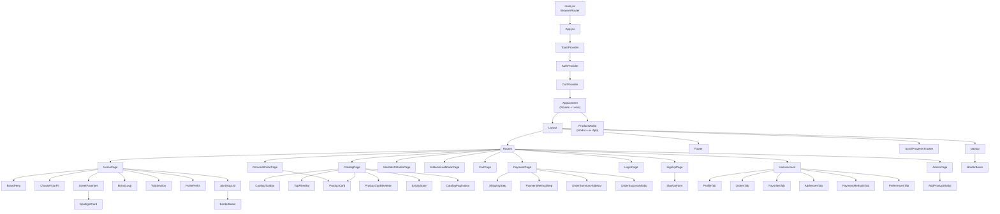
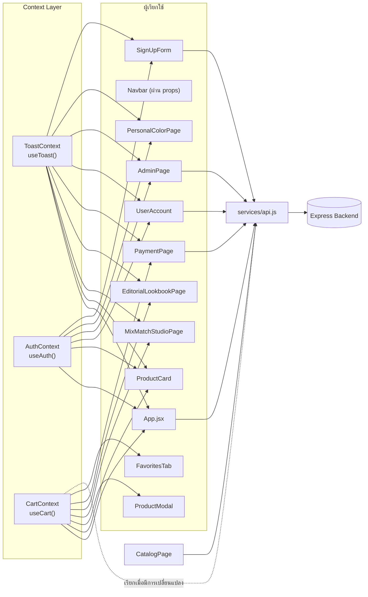
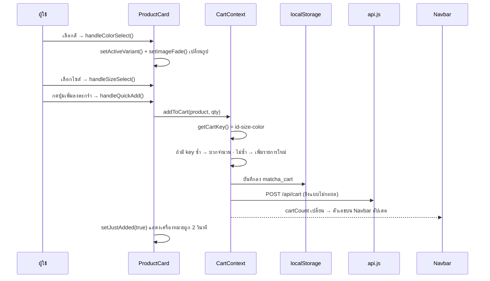

# MatchA — คู่มืออ้างอิงคอมโพเนนต์ (Component Reference & UI Anatomy)

> **โครงการ:** MatchA — Personal Color Fashion & Accessories E-Commerce Platform
> **เวอร์ชันเอกสาร:** 1.0 · **วันที่:** 7 กันยายน 2569
> **ขอบเขต:** ทุกไฟล์ใน `app/frontend/src` — 63 โมดูล
> **เอกสารคู่กัน:** [`01-Project-Proposal.md`](./01-Project-Proposal.md) · [`02-Technical-Spec.md`](./02-Technical-Spec.md)

> **วิธีอ่านเอกสารนี้**
> เอกสารนี้เขียนจากการอ่านซอร์สโค้ดจริงทุกไฟล์ ไม่ได้เขียนจากเอกสารออกแบบ — ชื่อ props, state, ฟังก์ชัน และจำนวนบรรทัดทั้งหมดดึงมาจากไฟล์โดยตรง
> ถ้าพบว่าบางอย่างไม่ตรงกับเอกสารฉบับอื่น ให้ยึดเอกสารนี้เป็นหลักในเรื่อง "โค้ดตอนนี้เป็นอย่างไร"

---

## สารบัญ

1. [ภาพรวมและวิธีอ่าน](#1-ภาพรวมและวิธีอ่าน)
2. [แผนผังคอมโพเนนต์รวม](#2-แผนผังคอมโพเนนต์รวม-global-component-map)
3. [ผังการไหลของข้อมูล](#3-ผังการไหลของข้อมูล-data-flow)
4. [กายวิภาคหน้าจอ](#4-กายวิภาคหน้าจอ-ui-anatomy) — 11 หน้า
5. [อ้างอิงคอมโพเนนต์รายตัว](#5-อ้างอิงคอมโพเนนต์รายตัว-component-reference) — 38 ตัว
6. [อ้างอิง Context](#6-อ้างอิง-context-state-layer) — 3 ตัว
7. [อ้างอิง Service, Hook & Utility](#7-อ้างอิง-service-hook--utility)
8. [ไฟล์ที่ยังไม่ถูกเรียกใช้](#8-ไฟล์ที่ยังไม่ถูกเรียกใช้-unreferenced-modules)
9. [ตารางค้นหาเรียงตามตัวอักษร](#9-ตารางค้นหาเรียงตามตัวอักษร-index)

---

## 1. ภาพรวมและวิธีอ่าน

### 1.1 จำนวนโมดูลทั้งหมด

| ประเภท | จำนวนไฟล์ | ถูกเรียกใช้ | ยังไม่ถูกเรียกใช้ |
| :--- | :---: | :---: | :---: |
| Page | 12 | 11 | 1 |
| Component | 38 | 32 | 6 |
| Context | 4 (รวม barrel) | 4 | 0 |
| Service | 1 | 1 | 0 |
| Hook | 3 | 3 | 0 |
| Utility | 2 | 2 | 0 |
| Data | 3 | 2 | 1 |
| Entry (`main.jsx`, `App.jsx`) | 2 | 2 | 0 |
| **รวม** | **65** | **57** | **8** |

### 1.2 คอมโพเนนต์แยกตามโฟลเดอร์

| โฟลเดอร์ | จำนวน | บทบาท |
| :--- | :---: | :--- |
| `components/account/` | 7 | แท็บต่าง ๆ ใน Member Lounge |
| `components/admin/` | 1 | ฟอร์มเพิ่มสินค้าของแอดมิน |
| `components/auth/` | 2 | ฟอร์มสมัครสมาชิกและ modal เข้าสู่ระบบ |
| `components/cart/` | 1 | ลิ้นชักตะกร้าสินค้า |
| `components/catalog/` | 6 | ตัวกรอง แถบเครื่องมือ และการ์ดสินค้าชุดแคตตาล็อก |
| `components/home/` | 7 | ส่วนต่าง ๆ ของหน้าแรก |
| `components/layout/` | 3 | โครงร่างที่ใช้ร่วมทุกหน้า |
| `components/payment/` | 4 | ขั้นตอนการชำระเงิน |
| `components/product/` | 2 | การ์ดสินค้าและ modal ที่ใช้งานจริง |
| `components/ui/` | 5 | ชิ้นส่วนพื้นฐานที่ไม่ผูกกับโดเมน |

### 1.3 ลำดับชั้นของคอมโพเนนต์

```
ชั้นที่ 1  Entry            main.jsx → App.jsx
              │              ตั้ง Router, Provider tree, Lenis smooth scroll
              ▼
ชั้นที่ 2  Layout           Layout → Navbar · Footer · ScrollProgressTracker
              │              โครงร่างที่ครอบทุกหน้า
              ▼
ชั้นที่ 3  Page             HomePage · CatalogPage · MixMatchStudioPage · …
              │              ดึงข้อมูล ถือ state ของหน้า ส่ง props ลงไป
              ▼
ชั้นที่ 4  Feature          ProductCard · CartDrawer · ShippingStep · …
              │              ตรรกะเฉพาะโดเมน เรียก Context ได้
              ▼
ชั้นที่ 5  UI Primitive     SpotlightCard · BorderBeam · EmptyState · Skeleton
                             ไม่รู้จักโดเมน ใช้ซ้ำได้ทุกที่
```

### 1.4 กติกาการตั้งชื่อที่พบในโค้ด

| รูปแบบ | ความหมาย | ตัวอย่าง |
| :--- | :--- | :--- |
| `PascalCase.jsx` | ไฟล์คอมโพเนนต์ | `ProductCard.jsx` |
| `handle*` | ฟังก์ชันตอบสนองเหตุการณ์จากผู้ใช้ | `handleColorSelect`, `handleSubmit` |
| `on*` (ใน props) | callback ที่ส่งจาก parent ลงมา | `onAddToCart`, `onClose` |
| `is*` / `has*` | ค่าบูลีน | `isOpen`, `isWishlisted` |
| `use*` | React Hook | `useCart`, `useToast` |
| `*Tab.jsx` | คอมโพเนนต์ที่เป็นแท็บย่อยของหน้า | `ProfileTab`, `OrdersTab` |
| `*Step.jsx` | ขั้นตอนหนึ่งใน flow หลายขั้น | `ShippingStep`, `PaymentMethodStep` |
| `*Modal.jsx` / `*Drawer.jsx` | หน้าต่างซ้อน / ลิ้นชักเลื่อนเข้า | `ProductModal`, `CartDrawer` |

### 1.5 รูปแบบการ์ดอ้างอิงในหัวข้อที่ 5

```
#### ชื่อคอมโพเนนต์                     ← ชื่อที่ import ไปใช้
`path/ไฟล์.jsx` · N บรรทัด · ใช้ใน: หน้าไหนบ้าง

หน้าที่    หนึ่งประโยคว่าคอมโพเนนต์นี้ทำอะไร
Props     พารามิเตอร์ที่รับเข้ามา
State     ตัวแปรสถานะภายใน (useState)
Ref       useRef ที่ใช้ (ถ้ามี)
Hook      Context หรือ Router hook ที่เรียก
ฟังก์ชัน   ฟังก์ชันภายในและสิ่งที่มันทำ
เชื่อมกับ  คอมโพเนนต์หรือ Context ที่ทำงานต่อจากนี้
```

---

## 2. แผนผังคอมโพเนนต์รวม (Global Component Map)



> คอมโพเนนต์ที่ **ไม่ปรากฏในผังนี้** คือคอมโพเนนต์ที่ยังไม่มีไฟล์ใดเรียกใช้ — ดูรายการเต็มในหัวข้อที่ 8

### 2.1 คอมโพเนนต์ที่ถูกใช้ซ้ำหลายที่

| คอมโพเนนต์ | ถูกใช้ใน |
| :--- | :--- |
| `ProductCard` (`components/product/`) | `CatalogPage` · `PersonalColorPage` |
| `BorderBeam` | `Navbar` · `JoinDropList` |
| `handleImageError` (utility) | 7 ไฟล์ — `ProductCard`, `ProductModal`, `FavoritesTab`, `OrdersTab`, `OrderSummarySidebar`, `MixMatchStudioPage`, `EditorialLookbookPage` |

---

## 3. ผังการไหลของข้อมูล (Data Flow)

### 3.1 Context ถูกเรียกจากที่ไหนบ้าง



**จำนวนจุดที่เรียกแต่ละ Context** — `useToast` 14 จุด · `useCart` 10 จุด · `useAuth` 8 จุด

### 3.2 เส้นทางข้อมูลของการเพิ่มสินค้าลงตะกร้า



### 3.3 ค่าที่คำนวณอัตโนมัติใน CartContext

| ค่า | สูตร | ใช้ที่ไหน |
| :--- | :--- | :--- |
| `cartCount` | ผลรวม `quantity` ของทุกรายการ | ตัวเลขบนไอคอนตะกร้าใน `Navbar` |
| `subtotal` | ผลรวม `ราคา × จำนวน` (แปลงราคาที่เป็นข้อความด้วย `parsePrice`) | `CartPage`, `OrderSummarySidebar` |
| `shipping` | ตะกร้าว่าง **หรือ** `subtotal ≥ 100` → `0` · นอกนั้น → `10` | `OrderSummarySidebar` |
| `total` | `subtotal + shipping` | `PaymentPage` |
| `awayFromFreeShipping` | `max(0, 100 − subtotal)` | ข้อความ "ซื้ออีก $X ส่งฟรี" |

### 3.4 กุญแจที่ใช้เก็บข้อมูลในเบราว์เซอร์

| กุญแจ | ที่เก็บ | เนื้อหา | จัดการโดย |
| :--- | :--- | :--- | :--- |
| `matcha_cart` | `localStorage` | รายการสินค้าในตะกร้า | `CartContext` |
| `matcha_user` | `localStorage` **หรือ** `sessionStorage` | ข้อมูลผู้ใช้ที่เข้าสู่ระบบ | `AuthContext` |

> `AuthContext` เลือกที่เก็บตามตัวเลือก "จดจำฉัน" — เลือก → `localStorage` (อยู่ข้ามการปิดเบราว์เซอร์) · ไม่เลือก → `sessionStorage` (หายเมื่อปิดแท็บ) และจะลบอีกฝั่งทิ้งเสมอเพื่อไม่ให้มีข้อมูลค้างสองที่

---

## 4. กายวิภาคหน้าจอ (UI Anatomy)

แต่ละหน้าแสดง **ผังโครงหน้าจอ** พร้อมชื่อไฟล์กำกับ และ **ตารางไล่ชิ้นส่วน**

### 4.0 โครงร่างที่ครอบทุกหน้า

```
┌──────────────────────────────────────────────────────────────┐
│ ▓▓▓▓▓▓▓▓▓░░░░░░░░░░░░░░░░░░░░░░░░  แถบความคืบหน้าการเลื่อน    │ ui/ScrollProgressTracker.jsx
├──────────────────────────────────────────────────────────────┤
│  MatchA        Shop  Personal Color  Mix&Match     👤  🛍3    │ layout/Navbar.jsx
│                                                     ▲         │   └ ui/BorderBeam.jsx
│                                          ตัวเลขมาจาก cartCount │
├──────────────────────────────────────────────────────────────┤
│                                                              │
│                    {children} — เนื้อหาของแต่ละหน้า            │ ← Routes
│                                                              │
├──────────────────────────────────────────────────────────────┤
│  MatchA · ลิงก์ · โซเชียล · ลิขสิทธิ์                          │ layout/Footer.jsx
└──────────────────────────────────────────────────────────────┘

     ProductModal เปิดทับทั้งหน้าจอเมื่อกดดูสินค้า                 product/ProductModal.jsx
     (ถูกวางไว้ที่ระดับ App.jsx ไม่ใช่ในหน้าใดหน้าหนึ่ง)
```

| ชิ้นส่วน | ไฟล์ | หมายเหตุ |
| :--- | :--- | :--- |
| แถบความคืบหน้า | `ui/ScrollProgressTracker.jsx` | คำนวณจากตำแหน่ง scroll ด้วย `requestAnimationFrame` |
| แถบนำทาง | `layout/Navbar.jsx` | มีเมนูมือถือ · ปุ่มออกจากระบบมีสถานะกำลังโหลด |
| เส้นขอบเรืองแสง | `ui/BorderBeam.jsx` | ใช้ใน Navbar และ JoinDropList |
| ส่วนท้าย | `layout/Footer.jsx` | คงที่ ไม่มี state |
| ตัวห่อ | `layout/Layout.jsx` | รับ `cartCount`, `currentUser`, `onLogout` แล้วส่งต่อให้ Navbar · ผูก `useChangeMotion(pathname, 'route')` ไว้ที่ `<main>` เพื่อเฟดเนื้อหาตอนเปลี่ยนหน้า |

---

### 4.1 หน้าแรก — `/`

`pages/HomePage.jsx` · 68 บรรทัด · เป็น container บาง ๆ ที่เรียง 7 ส่วนต่อกัน

```
┌──────────────────────────────────────────────────────────────┐
│  ╔═══════╦═══════╦═══════╦═══════╗                           │
│  ║SPRING ║SUMMER ║AUTUMN ║WINTER ║  4 แผ่นแนวตั้ง             │ home/BrandHero.jsx
│  ║       ║       ║ ◀ขยาย ║       ║  ขยายตามตำแหน่งเมาส์       │ (322 บรรทัด)
│  ║       ║       ║       ║       ║  + ปุ่ม Shop Now           │
│  ╚═══════╩═══════╩═══════╩═══════╝                           │
├──────────────────────────────────────────────────────────────┤
│  CHOOSE YOUR FIT                                             │ home/ChooseYourFit.jsx
│  ┌──────┐ ┌──────┐ ┌──────┐   คลิกทรง → ไปหน้า Catalog        │
│  │Boxy  │ │Linen │ │Tote  │   พร้อมกรองหมวดหมู่ให้แล้ว         │
│  └──────┘ └──────┘ └──────┘                                  │
├──────────────────────────────────────────────────────────────┤
│  STREET FAVORITES                          ◀  ▶              │ home/StreetFavorites.jsx
│  ┌────────┐┌────────┐┌────────┐┌────────┐  เลื่อนแนวนอน       │ (235 บรรทัด)
│  │ ●●●○   ││ ●●○    ││ ●●●●   ││ ●●○    │  จุดสี = สลับ variant│  └ StreetFavoriteCard
│  └────────┘└────────┘└────────┘└────────┘                    │  └ ui/SpotlightCard.jsx
├──────────────────────────────────────────────────────────────┤
│  ← MATCHA · MATCHA · MATCHA · MATCHA →  แถบข้อความวิ่ง         │ home/BrandLoop.jsx
├──────────────────────────────────────────────────────────────┤
│  ▶ วิดีโอแบรนด์ + ปุ่มรับโปรโมชัน                              │ home/VdoSection.jsx
├──────────────────────────────────────────────────────────────┤
│  PULSE PERKS — การ์ดเอียงตามเมาส์ 3 มิติ                       │ home/PulsePerks.jsx
├──────────────────────────────────────────────────────────────┤
│  JOIN THE DROP LIST   [ กรอกอีเมล ] [ สมัคร ]                 │ home/JoinDropList.jsx
│  └ เส้นขอบเรืองแสงรอบกล่อง                                    │  └ ui/BorderBeam.jsx
└──────────────────────────────────────────────────────────────┘
```

| ลำดับ | ชิ้นส่วน | ไฟล์ | สิ่งที่ทำเมื่อคลิก |
| :---: | :--- | :--- | :--- |
| ① | Hero 4 ฤดู | `home/BrandHero.jsx` | `onShopNow` → เลื่อนลงไปที่ Choose Your Fit |
| ② | เลือกทรง | `home/ChooseYourFit.jsx` | `onSelectFit` → `App.jsx` นำทางไป `/catalog` พร้อมตั้งหมวดหมู่ |
| ③ | สินค้ายอดนิยม | `home/StreetFavorites.jsx` | `onAddToCart` / `onQuickView` / `onExploreCatalog` |
| ④ | แถบแบรนด์ | `home/BrandLoop.jsx` | — (แสดงผลอย่างเดียว) |
| ⑤ | วิดีโอ | `home/VdoSection.jsx` | `onClaimPromo` |
| ⑥ | สิทธิประโยชน์ | `home/PulsePerks.jsx` | — (เอฟเฟกต์เมาส์อย่างเดียว) |
| ⑦ | สมัครรับข่าวสาร | `home/JoinDropList.jsx` | `onSubscribe` |

---

### 4.2 หน้าแคตตาล็อก — `/catalog`

`pages/CatalogPage.jsx` · 312 บรรทัด · 14 state · 3 effect · 2 memo

```
┌──────────────────────────────────────────────────────────────┐
│  🔍 [ ค้นหา ]   [ALL][Tops][Bottoms][Outer][Acc]              │ catalog/CatalogToolbar.jsx
│                 ⚙ ตัวกรอง(3)   เรียงตาม ▾   ▦ ▤ ▥            │ (119 บรรทัด)
├──────────────────────────────────────────────────────────────┤
│  ฤดู ▾   สี ▾   ทรง ▾   ราคา ▾   ☑ มีสต็อก   ↺ ล้าง          │ catalog/TopFilterBar.jsx
│  └ dropdown เปิดทีละอัน · คลิกนอกกรอบแล้วปิดเอง               │ (354 บรรทัด)
├──────────────────────────────────────────────────────────────┤
│  ┌────────┐ ┌────────┐ ┌────────┐ ┌────────┐                 │
│  │ [รูป]  │ │ [รูป]  │ │ [รูป]  │ │ [รูป]  │  ← กำลังโหลด:    │ product/ProductCard.jsx
│  │  ♡ 👁  │ │  ♡ 👁  │ │  ♡ 👁  │ │  ♡ 👁  │    แสดง Skeleton │ (304 บรรทัด)
│  │ ชื่อ   │ │ ชื่อ   │ │ ชื่อ   │ │ ชื่อ   │    แทนทั้งกริด   │
│  │ ●●●○   │ │ ●●○    │ │ ●●●●   │ │ ●●○    │  ← ว่าง:         │ ui/ProductCardSkeleton.jsx
│  │ S M L  │ │ S M L  │ │ S M L  │ │ S M L  │    แสดง EmptyState│ ui/EmptyState.jsx
│  │ $42.00 │ │ $54.00 │ │ $38.00 │ │ $61.00 │                 │
│  └────────┘ └────────┘ └────────┘ └────────┘                 │
├──────────────────────────────────────────────────────────────┤
│         ‹  1  2  3  ›     แสดง 1–24 จาก 60 รายการ            │ catalog/CatalogPagination.jsx
└──────────────────────────────────────────────────────────────┘
```

| ชิ้นส่วน | ไฟล์ | props ที่สำคัญ |
| :--- | :--- | :--- |
| แถบเครื่องมือ | `catalog/CatalogToolbar.jsx` | `searchQuery`, `categories`, `sortBy`, `gridCols`, `activeFilterCount` |
| แถบตัวกรอง | `catalog/TopFilterBar.jsx` | `seasonOptions`, `colorOptions`, `fitOptions`, `priceRange`, `inStockOnly` |
| การ์ดสินค้า | `product/ProductCard.jsx` | `product`, `onAddToCart`, `onQuickView`, `onToggleWishlist` |
| โครงระหว่างโหลด | `ui/ProductCardSkeleton.jsx` | — |
| สถานะว่าง | `ui/EmptyState.jsx` | `title`, `description`, `actionLabel`, `onAction` |
| แบ่งหน้า | `catalog/CatalogPagination.jsx` | `currentPage`, `totalPages`, `onPageChange` |

**state ทั้ง 14 ตัวของหน้านี้**
`products` · `categories` · `loading` · `error` · `searchQuery` · `selectedCategory` · `selectedSeason` · `selectedColor` · `selectedFit` · `priceRange` · `inStockOnly` · `sortBy` · `gridCols` · `currentPage`

**การดึงข้อมูล** — `fetchCats()` เรียก `api.getCategories()` ครั้งเดียวตอนเข้าหน้า · `loadProducts()` เรียก `api.getProducts()` ใหม่ทุกครั้งที่ตัวกรองหรือหน้าเปลี่ยน

---

### 4.3 หน้า Personal Color — `/personal-color`

`pages/PersonalColorPage.jsx` · 556 บรรทัด

```
┌──────────────────────────────────────────────────────────────┐
│        [ ✨ ทำแบบทดสอบ ]   [ 📖 ทฤษฎีสี ]                     │ ← activeTab
├──────────────────────────────────────────────────────────────┤
│                                                              │
│  โหมด "quiz"                    │  โหมด "theory"             │
│  ─────────────                  │  ─────────────             │
│  คำถามที่ 2 / N                  │  [Spring][Summer]          │ ← selectedSeasonTab
│  ┌────────────────────────┐     │  [Autumn][Winter]          │
│  │ เส้นเลือดข้อมือสีอะไร?  │     │  ────────────────          │
│  │ ○ เขียว                │     │  ชื่อฤดู + ชื่อไทย          │
│  │ ○ น้ำเงิน/ม่วง          │     │  Undertone                 │
│  │ ○ มองไม่ชัด            │     │  คำอธิบายลักษณะผิว          │
│  └────────────────────────┘     │  ●●●●●● พาเลตต์ 6 สี        │
│         ↓ ตอบครบ                 │  สีที่ควรเลี่ยง             │
│  ┌────────────────────────┐     │  ผ้าที่แนะนำ                │
│  │ ✅ คุณคือ Autumn Warm   │     │                            │
│  │ [ ทำใหม่ ↺ ]           │     │                            │
│  └────────────────────────┘     │                            │
├──────────────────────────────────────────────────────────────┤
│  สินค้าแนะนำสำหรับโทนนี้                                       │
│  ┌────────┐ ┌────────┐ ┌────────┐ ┌────────┐                 │ product/ProductCard.jsx
│  └────────┘ └────────┘ └────────┘ └────────┘                 │
└──────────────────────────────────────────────────────────────┘
```

| ชิ้นส่วน | รายละเอียด |
| :--- | :--- |
| `SEASON_PROFILES` | ค่าคงที่ในไฟล์ — โปรไฟล์ครบ 4 ฤดู แต่ละฤดูมี `thaiName`, `undertone`, `description`, `characteristics`, `palette` (6 สี), `avoidColors`, `recommendedFabrics` |
| `QUIZ_QUESTIONS` | ชุดคำถามหาฤดูสี |
| `calculateResult()` | นับคะแนนคำตอบแล้วสรุปเป็น `diagnosedSeason` |
| `handleSelectOption()` | บันทึกคำตอบและเลื่อนไปคำถามถัดไป |
| `handleResetQuiz()` | ล้างคำตอบทั้งหมด กลับไปข้อแรก |
| สินค้าแนะนำ | กรอง `productsData` ด้วย `curatedSeason` — โหมด theory ใช้ฤดูที่กดเลือก · โหมด quiz ใช้ผลวินิจฉัย |

**state 6 ตัว** — `activeTab` · `currentStep` · `answers` · `diagnosedSeason` · `isScanning` · `selectedSeasonTab`

---

### 4.4 หน้า Mix & Match Studio — `/mix-match`

`pages/MixMatchStudioPage.jsx` · 674 บรรทัด · 9 state · 5 memo — เป็นหน้าที่ผูกกับ Color Harmony Engine โดยตรง

```
┌──────────────────────────────────────────────────────────────┐
│  MIX & MATCH STUDIO    [✨ พรีเซ็ต] [🔀 สุ่ม] [🎨 พาเลตต์]      │
├────────────────────────────────┬─────────────────────────────┤
│  ช่องเลือก 4 ช่อง               │  ผลวิเคราะห์                 │
│  ┌──────────────────────────┐  │  ┌───────────────────────┐  │
│  │ 👕 Tops        [ รูป ]   │  │  │   SYNERGY SCORE       │  │
│  │ ✂️ Bottoms     [ รูป ]   │  │  │        92 / 100       │  │
│  │ 👟 Footwear    [ รูป ]   │  │  ├───────────────────────┤  │
│  │ 💼 Accessories [ รูป ]   │  │  │ Harmony: Analogous    │  │
│  └──────────────────────────┘  │  │ Undertone: Autumn 100%│  │
│        ↑ activeSlotTab          │  │ Delta E: 34           │  │
│  ┌──────────────────────────┐  │  │ Itten: Light-Dark ✓   │  │
│  │ [👕][✂️][👟][💼]  แท็บ    │  │  │ สัดส่วน 60-30-10      │  │
│  │ ┌───┐┌───┐┌───┐┌───┐     │  │  ├───────────────────────┤  │
│  │ │   ││   ││ ✓ ││   │     │  │  │ 💡 คำแนะนำการแต่งตัว   │  │
│  │ └───┘└───┘└───┘└───┘     │  │  └───────────────────────┘  │
│  │ รายการสินค้าตามแท็บ       │  │  [ ➕ ใส่ทั้งชุดลงตะกร้า ]  │
│  └──────────────────────────┘  │                             │
└────────────────────────────────┴─────────────────────────────┘
                                    ▲ ความสูงคอลัมน์ขวาซิงก์กับซ้าย
                                      ด้วย leftColRef + updateHeight()
```

| องค์ประกอบ | รายละเอียด |
| :--- | :--- |
| `OUTFIT_PRESETS` | ชุดสำเร็จรูป 4 ชุด (`PRESET-01` ถึง `PRESET-04`) |
| ช่องเลือก 4 ช่อง | `selectedTop` · `selectedBottom` · `selectedFootwear` · `selectedAccessory` |
| `isFootwear(p)` | ตัวช่วยแยกว่าสินค้าชิ้นไหนจัดเป็นรองเท้า |
| `handleApplyPreset()` | ใส่ทั้ง 4 ช่องพร้อมกันจากพรีเซ็ต |
| `handleRandomize()` | สุ่มสินค้าใส่ทั้ง 4 ช่อง |
| `handleAddBundleToCart()` | เพิ่มทุกชิ้นที่เลือกลงตะกร้าในครั้งเดียว แล้วตั้ง `justAddedBundle` |
| `updateHeight()` + `handleResize()` | ปรับให้คอลัมน์ขวาสูงเท่าซ้ายบนจอใหญ่ (`isLgScreen`) |
| **การคำนวณคะแนน** | `computeOutfitSynergy(top, bottom, footwear, accessory)` จาก `utils/fashionTheory.js` |

---

### 4.5 หน้า Editorial Lookbook — `/lookbook` และ `/editorial`

`pages/EditorialLookbookPage.jsx` · 1,008 บรรทัด · เป็นไฟล์ที่ใหญ่เป็นอันดับสองของโปรเจกต์

```
┌──────────────────────────────────────────────────────────────┐
│  [Spring][Summer][Autumn][Winter]   ← selectedSeason          │
├──────────────────────────────────────────────────────────────┤
│  ‹                                                        ›  │ handlePrevSpread /
│      ┌──────────────────────────────────────────┐            │ handleNextSpread
│      │                                          │            │
│      │        ภาพ Editorial เต็มหน้า             │            │ TiltCard
│      │              ⊙ ← จุด hotspot             │            │ (คอมโพเนนต์ในไฟล์เดียวกัน
│      │                  ┌──────────────┐        │            │  เอียงตามเมาส์ + แสงสะท้อน)
│      │           ⊙      │ ชื่อสินค้า    │        │            │
│      │                  │ $42.00       │        │            │
│      │                  │ [+ ใส่ตะกร้า]│        │            │
│      │                  └──────────────┘        │            │
│      │                        ▲ activeHotspot   │            │
│      └──────────────────────────────────────────┘            │
│         ♡ ถูกใจ    🔍 ซูม    ↗ แชร์                           │
├──────────────────────────────────────────────────────────────┤
│  [ ➕ ใส่ทั้งลุคลงตะกร้า ]                                     │ handleAddEntireLook
└──────────────────────────────────────────────────────────────┘
```

| องค์ประกอบ | รายละเอียด |
| :--- | :--- |
| `TiltCard` | คอมโพเนนต์ย่อยในไฟล์เดียวกัน — รับ `maxTilt`, `enabled`, `onClick` · เอียงการ์ดตามตำแหน่งเมาส์พร้อมแสงสะท้อน (`glarePos`) |
| แหล่งข้อมูล | `data/curatedEditorialSpreads.js` |
| `handleNextSpread` / `handlePrevSpread` | เลื่อนไปหน้าถัดไป/ก่อนหน้าของ spread |
| `handleKeyDown` | รองรับปุ่มลูกศรและ Escape |
| `toggleLike` | บันทึกลุคที่ถูกใจไว้ใน `likedLooks` |
| `isHotspotActive` | ตรวจว่าจุด hotspot ไหนกำลังเปิดอยู่ |
| `handleQuickAdd` | เพิ่มสินค้าชิ้นเดียวจาก hotspot |
| `handleAddEntireLook` | เพิ่มทุกชิ้นในลุคนั้นลงตะกร้า แล้วตั้ง `addedEntireLook` |

**state 11 ตัว** — `style` · `glarePos` · `selectedSeason` · `selectedSpread` · `activeHotspot` · `hoveredItemId` · `likedLooks` · `addedItems` · `addedEntireLook` · `ambientMotion` · `isZoomed`

---

### 4.6 หน้าตะกร้า — `/cart`

`pages/CartPage.jsx` · 195 บรรทัด

```
┌──────────────────────────────────────────────────────────────┐
│  ‹ กลับไปเลือกซื้อ                                            │ onBackToStore
├──────────────────────────────────────┬───────────────────────┤
│  ┌────┐  ชื่อสินค้า                   │  สรุปคำสั่งซื้อ        │
│  │รูป │  ไซส์ M · สี Olive           │  ─────────────        │
│  └────┘  [−] 2 [+]        🗑         │  ยอดรวม    $84.00     │
│  ─────────────────────────────────    │  ค่าส่ง      $0.00     │
│  ┌────┐  ชื่อสินค้า                   │  ─────────────        │
│  │รูป │  ไซส์ L · สี Cream           │  รวมทั้งสิ้น $84.00    │
│  └────┘  [−] 1 [+]        🗑         │                       │
│                                       │  🔒 [ ชำระเงิน ]      │ onCheckout
│         ▲ onUpdateQty / onRemove      │                       │
└──────────────────────────────────────┴───────────────────────┘
```

| props | หน้าที่ |
| :--- | :--- |
| `cartItems` | รายการสินค้าที่ส่งมาจาก `App.jsx` |
| `onUpdateQty` | ปรับจำนวน |
| `onRemove` | ลบรายการ |
| `onBackToStore` | กลับไปหน้าแคตตาล็อก |
| `onCheckout` | ไปหน้าชำระเงิน |

> หน้านี้มีฟังก์ชัน `getCartKey` ของตัวเองซ้ำกับที่ `CartContext` export ออกมา

---

### 4.7 หน้าชำระเงิน — `/payment`

`pages/PaymentPage.jsx` · 248 บรรทัด · flow 2 ขั้น + modal ยืนยัน

```
ขั้นที่ 1 (step = 1)                    ขั้นที่ 2 (step = 2)
┌────────────────────┬───────────┐    ┌────────────────────┬───────────┐
│ ShippingStep       │ Order     │    │ PaymentMethodStep  │ Order     │
│ ─────────────      │ Summary   │    │ ─────────────      │ Summary   │
│ ชื่อ / นามสกุล      │ Sidebar   │    │ ○ Visa             │ Sidebar   │
│ อีเมล / เบอร์       │ ─────     │    │ ○ Mastercard       │ ─────     │
│ ที่อยู่ / เมือง      │ [สินค้า]  │    │ ○ PromptPay QR     │ [สินค้า]  │
│ รหัสไปรษณีย์        │ [สินค้า]  │    │ ○ COD              │           │
│                    │ ─────     │    │ ┌────────────────┐ │ คูปอง:    │
│ วิธีจัดส่ง:         │ ยอดรวม    │    │ │ เลขบัตร        │ │ [_____]   │
│ ○ Standard         │ ค่าส่ง    │    │ │ วันหมดอายุ CVV │ │ [ใช้]     │
│ ○ Express          │ ส่วนลด    │    │ └────────────────┘ │           │
│ ○ Same-Day         │ ─────     │    │                    │ รวม       │
│                    │ รวม       │    │ ‹ ย้อนกลับ         │           │
│      [ ถัดไป › ]   │           │    │      [ สั่งซื้อ ]   │           │
└────────────────────┴───────────┘    └────────────────────┴───────────┘
 payment/ShippingStep.jsx              payment/PaymentMethodStep.jsx
 payment/OrderSummarySidebar.jsx       payment/OrderSummarySidebar.jsx

                         ↓ handlePlaceOrder()
              ┌──────────────────────────────┐
              │   ✅ สั่งซื้อสำเร็จ            │  payment/OrderSuccessModal.jsx
              │   เลขที่ ORD-xxxxx           │
              │   📅 วันเวลาสั่งซื้อ           │
              │        [ เสร็จสิ้น › ]        │
              └──────────────────────────────┘
```

| ชิ้นส่วน | ไฟล์ | บรรทัด |
| :--- | :--- | :---: |
| ขั้นที่อยู่จัดส่ง | `payment/ShippingStep.jsx` | 203 |
| ขั้นวิธีชำระเงิน | `payment/PaymentMethodStep.jsx` | 180 |
| สรุปคำสั่งซื้อด้านข้าง | `payment/OrderSummarySidebar.jsx` | 125 |
| หน้าต่างยืนยัน | `payment/OrderSuccessModal.jsx` | 80 |

**state 11 ตัว** — `step` · `selectedPayment` · `selectedShipping` · `formData` · `cardData` · `couponCode` · `appliedCoupon` · `couponError` · `isProcessing` · `showSuccessModal` · `createdOrder`

**การเรียก API** — `handlePlaceOrder()` เรียก `api.createOrder()` แล้วเก็บผลไว้ใน `createdOrder` เพื่อเอาเลขออเดอร์จริงไปแสดงใน modal

---

### 4.8 หน้าเข้าสู่ระบบ — `/login`

`pages/LoginPage.jsx` · 384 บรรทัด · 10 state

```
┌──────────────────────────────────────────────────────────────┐
│                    ✨  MATCHA                                 │
│              เข้าสู่ระบบเพื่อไปต่อ                              │
│  ┌──────────────────────────────────────────┐                │
│  │ ✉  อีเมล                                 │                │
│  ├──────────────────────────────────────────┤                │
│  │ 🔒 รหัสผ่าน                         👁    │ ← showPassword │
│  ├──────────────────────────────────────────┤                │
│  │ ☑ จดจำฉัน            ลืมรหัสผ่าน?        │ ← rememberMe   │
│  │                            ▲              │   (เลือกที่เก็บ)│
│  │                    เปิด forgotModal       │                │
│  ├──────────────────────────────────────────┤                │
│  │        [ เข้าสู่ระบบ  → ]                  │ handleLogin    │
│  ├──────────────────────────────────────────┤                │
│  │  [ กรอกบัญชีทดสอบ ]                       │ handleFillDemo │
│  │  ยังไม่มีบัญชี? สมัครสมาชิก                │ → /signup      │
│  └──────────────────────────────────────────┘                │
│              🛡 การเชื่อมต่อปลอดภัย                            │
└──────────────────────────────────────────────────────────────┘
```

| ฟังก์ชัน | หน้าที่ |
| :--- | :--- |
| `handleLogin()` | ตรวจข้อมูลแล้วเรียก `login()` ของ `AuthContext` พร้อมค่า `rememberMe` |
| `handleFillDemo()` | เติมบัญชีทดสอบให้อัตโนมัติ |
| `handleSendReset()` | ส่งคำขอรีเซ็ตรหัสผ่านในหน้าต่าง `forgotModal` แล้วตั้ง `forgotSent` |

---

### 4.9 หน้าสมัครสมาชิก — `/signup`

`pages/SignUpPage.jsx` · 37 บรรทัด (เป็นเปลือกบาง ๆ) → ห่อ `components/auth/SignUpForm.jsx` · 212 บรรทัด

```
┌──────────────────────────────────────────────────────────────┐
│  ‹ กลับไปที่ร้าน                                              │ SignUpPage
├──────────────────────────────────────────────────────────────┤
│  ┌──────────────────────────────────────────┐                │
│  │ 👤 ชื่อ-นามสกุล                           │                │ SignUpForm
│  │ ✉  อีเมล                                 │                │
│  │ 🔒 รหัสผ่าน                               │                │
│  │ 🔒 ยืนยันรหัสผ่าน                          │                │
│  │  ⚠ ข้อความแจ้งข้อผิดพลาด (ถ้ามี)          │ ← error        │
│  │        [ สมัครสมาชิก  → ]                  │ handleSubmit   │
│  └──────────────────────────────────────────┘                │
│              🛡 ข้อมูลของคุณปลอดภัย                            │
└──────────────────────────────────────────────────────────────┘
```

`handleSubmit()` เรียก `api.createUser()` → เมื่อสำเร็จเรียก `login()` ของ `AuthContext` แล้วนำทางออกไป

---

### 4.10 หน้าบัญชีสมาชิก — `/account`

`pages/UserAccount.jsx` · 314 บรรทัด · เมนู 7 รายการ ประกอบร่างจาก 6 คอมโพเนนต์แท็บ

```
┌──────────────────────────────────────────────────────────────┐
│  👤 ชื่อผู้ใช้           🛡 ระดับสมาชิก: VIP Connoisseur       │
├──────────────────┬───────────────────────────────────────────┤
│ 👤 PERSONAL      │                                           │
│    DETAILS  ◀    │   ProfileTab                              │ account/ProfileTab.jsx
│ 📦 ORDER HISTORY │   ├ ชื่อ / อีเมล / เบอร์โทร                │
│ ♡  SAVED ARCHIVE │   └ [ บันทึก ]  ✓ บันทึกแล้ว              │
│ 📍 ADDRESS BOOK  │                                           │
│ 💳 PAYMENT       │   สลับตามค่า activeTab:                    │
│    METHODS       │   'products'    → OrdersTab               │ account/OrdersTab.jsx
│ ⚙  PREFERENCES   │   'favorites'   → FavoritesTab            │ account/FavoritesTab.jsx
│ ──────────────   │   'address'     → AddressesTab            │ account/AddressesTab.jsx
│ 🚪 LOG OUT       │   'payment'     → PaymentMethodsTab       │ account/PaymentMethodsTab.jsx
│    (สีแดง)       │   'preferences' → PreferencesTab          │ account/PreferencesTab.jsx
│      ▲           │   'logout'      → กล่องยืนยันออกจากระบบ    │
│  handleTabClick  │                                           │
└──────────────────┴───────────────────────────────────────────┘
```

| `id` ของแท็บ | ป้ายที่แสดง | คอมโพเนนต์ |
| :--- | :--- | :--- |
| `details` | PERSONAL DETAILS | `ProfileTab` |
| `products` | ORDER HISTORY | `OrdersTab` |
| `favorites` | SAVED ARCHIVE | `FavoritesTab` |
| `address` | ADDRESS BOOK | `AddressesTab` |
| `payment` | PAYMENT METHODS | `PaymentMethodsTab` |
| `preferences` | PREFERENCES | `PreferencesTab` |
| `logout` | LOG OUT | ไม่มีคอมโพเนนต์แยก — แสดง `showLogoutConfirm` ในหน้า |

**การดึงข้อมูล** — เรียก `api.getOrders()` ตอนเข้าหน้าเพื่อเติม `orders` ให้ `OrdersTab`

---

### 4.11 หน้าแอดมิน — `/admin`

`pages/AdminPage.jsx` · **1,369 บรรทัด** — ไฟล์ที่ใหญ่ที่สุดในโปรเจกต์ · 11 state · 4 effect · 7 memo

```
┌──────────────────────────────────────────────────────────────┐
│  🛡 MATCHA COMMAND CENTER     🔍[ค้นหาทั้งระบบ]  ⬇ Export ▾  │
├──────────────────┬───────────────────────────────────────────┤
│ ▦ Overview & KPIs│                                           │
│ 📦 Inventory (60)│   activeTab = 'dashboard'                 │
│ 📋 Orders    (3) │   ┌─────┐┌─────┐┌─────┐┌─────┐            │
│ 📊 Revenue       │   │ยอด  ││ออเดอร์││สินค้า││สมาชิก│  การ์ด KPI │
│    Analytics     │   │ขาย  ││     ││     ││     │            │
│ ✔ VIP Customer   │   └─────┘└─────┘└─────┘└─────┘            │
│    Registry      │                                           │
│ 💾 Reports &     │   activeTab = 'inventory'                 │
│    Backups       │   ตารางสินค้า + [+10] [−5] [🗑]           │
│      ▲           │   + ปุ่มเปิด AddProductModal              │ admin/AddProductModal.jsx
│   ตัวเลขในวงเล็บ  │                                           │
│   คือ badge      │   activeTab = 'orders'                    │
│                  │   ตารางออเดอร์ + เปลี่ยนสถานะ              │
│                  │                                           │
│                  │   activeTab = 'analytics'                 │
│                  │   กราฟแท่งรายเดือน + สัดส่วนหมวดหมู่       │
│                  │                                           │
│                  │   activeTab = 'members'                   │
│                  │   ตารางสมาชิก + ปุ่มเลื่อน/ลดระดับ VIP     │
│                  │                                           │
│                  │   activeTab = 'backup'                    │
│                  │   ปุ่ม Export CSV 4 ชุด + JSON เต็มระบบ    │
└──────────────────┴───────────────────────────────────────────┘
```

| `id` ของแท็บ | ป้ายที่แสดง | badge |
| :--- | :--- | :--- |
| `dashboard` | Overview & KPIs | — |
| `inventory` | Inventory & Stock | จำนวนสินค้าทั้งหมด |
| `orders` | Orders Pipeline | จำนวนออเดอร์สถานะ Processing |
| `analytics` | Revenue Analytics | — |
| `members` | VIP Customer Registry | จำนวนสมาชิก VIP |
| `backup` | Reports & Backups | — |

**ฟังก์ชันหลัก 10 ตัว**

| ฟังก์ชัน | หน้าที่ | API ที่เรียก |
| :--- | :--- | :--- |
| `loadBackendData()` | ดึงสินค้า ออเดอร์ และสมาชิกพร้อมกันตอนเข้าหน้า | `getProducts` · `getOrders` · `getUsers` |
| `handleAddProduct()` | รับข้อมูลจาก `AddProductModal` แล้วสร้างสินค้าใหม่ | `createProduct` |
| `handleRestock()` | ปรับสต็อก `+10` / `−5` | `updateProduct` |
| `handleDeleteProduct()` | ลบสินค้า | `deleteProduct` |
| `handleUpdateOrderStatus()` | เปลี่ยนสถานะออเดอร์ | — (ปรับใน state) |
| `handleToggleVIPTier()` | เลื่อน/ลดระดับสมาชิก | — (ปรับใน state) |
| `downloadFile()` | ตัวช่วยสร้างไฟล์ให้ดาวน์โหลด — ใส่ BOM ให้ CSV เพื่อให้ Excel อ่านภาษาไทยได้ถูก | — |
| `handleExportInventory()` | ส่งออกคลังสินค้าเป็น CSV | — |
| `handleExportOrders()` | ส่งออกออเดอร์เป็น CSV | — |
| `handleExportFullJSON()` | ส่งออกข้อมูลทั้งระบบเป็น JSON | — |

**ตัวกรองในหน้า** — `globalSearch` · `inventoryCategoryFilter` · `inventoryStatusFilter` · `orderStatusFilter` · `memberTierFilter`

---

## 5. อ้างอิงคอมโพเนนต์รายตัว (Component Reference)

> เครื่องหมาย ⚠️ หน้าชื่อ = ไฟล์นี้ยังไม่มีไฟล์ใดเรียกใช้ (ดูหัวข้อที่ 8)

### 5.1 `components/layout/` — โครงร่าง

#### Layout
`components/layout/Layout.jsx` · 55 บรรทัด · ใช้ใน: `App.jsx`

| | |
| :--- | :--- |
| **หน้าที่** | ห่อทุกหน้าด้วย Navbar, Footer และแถบความคืบหน้า แล้วแสดง `children` ตรงกลาง |
| **Props** | `children` · `cartCount = 0` · `onOpenCart` · `onNavigate` · `onGoToLanding` · `currentPage = 'home'` · `currentUser = null` · `onLogout` |
| **State** | ไม่มี — เป็นคอมโพเนนต์ส่งผ่านล้วน |
| **Ref** | `<main>` รับสอง ref รวมกันผ่าน callback เดียว — `useChangeMotion(pathname, 'route')` เฟดเนื้อหา 240ms ตอนเปลี่ยนหน้า และ `useScrollReveal(pathname)` เป็น observer ตัวเดียวที่ดูแล `[data-reveal]` ของทั้งเว็บ |
| **เชื่อมกับ** | `Navbar` · `Footer` · `ScrollProgressTracker` · `hooks/useChangeMotion` |

#### Navbar
`components/layout/Navbar.jsx` · 291 บรรทัด · ใช้ใน: `Layout`

| | |
| :--- | :--- |
| **หน้าที่** | แถบนำทางด้านบน แสดงเมนู จำนวนสินค้าในตะกร้า และเมนูผู้ใช้ |
| **Props** | `cartCount = 0` · `currentUser = null` · `onLogout` และ callback การนำทาง |
| **State** | `mobileMenuOpen` · `cartAnimated` · `isLoggingOut` |
| **Effect** | 1 ตัว — สั่งให้ไอคอนตะกร้ากระพริบเมื่อ `cartCount` เปลี่ยน |
| **ฟังก์ชัน** | `handleLinkClick()` ปิดเมนูมือถือหลังคลิก · `handleLogoutClick()` แสดงสถานะกำลังออกจากระบบก่อนเรียก `onLogout` |
| **เชื่อมกับ** | `BorderBeam` (เอฟเฟกต์เส้นขอบ) |

#### Footer
`components/layout/Footer.jsx` · 68 บรรทัด · ใช้ใน: `Layout`

| | |
| :--- | :--- |
| **หน้าที่** | ส่วนท้ายเว็บ — ลิงก์ โซเชียล และข้อความลิขสิทธิ์ |
| **Props** | ไม่มี |
| **State** | ไม่มี — เนื้อหาคงที่ |

---

### 5.2 `components/home/` — ส่วนของหน้าแรก

#### BrandHero
`components/home/BrandHero.jsx` · 322 บรรทัด · ใช้ใน: `HomePage`

| | |
| :--- | :--- |
| **หน้าที่** | แบนเนอร์เปิดเว็บ 4 แผ่นแนวตั้งตามฤดู ขยายตามตำแหน่งเมาส์ และมีภาพหมุนเปลี่ยนในแต่ละแผ่น |
| **Props** | `onShopNow` · `onEnterWebsite` |
| **State** | `sliceModels` · `slicePlaying` · `stickyOffset` · `scrollProgress` |
| **Ref** | `sectionRef` — ใช้วัด `getBoundingClientRect()` ทุกเฟรมเพื่อคำนวณ `scrollProgress` |
| **Effect** | 2 ตัว — ลูป `requestAnimationFrame` สำหรับตรึง+ย่อหัวเรื่อง และรอบหมุนภาพทุก 1.3 วินาที |
| **ฟังก์ชัน** | `cycleSingleSlice()` สลับภาพในแผ่นหนึ่ง · `handleAction()` เรียก callback ที่รับมา |
| **การเคลื่อนไหว** | หัวเรื่องเปิดตัวด้วย CSS ครั้งเดียว (`home-masthead-title`) จากนั้นตรึงตำแหน่งและย่อจาก `scale(1)` ลงถึง `scale(0.65)` · opacity `1` → `0.8` ตามความคืบหน้าการเลื่อน |
| **⚠️ ทำไมต้องใช้ rAF** | Lenis smooth scroll กลืน native scroll event เกือบทั้งหมด (วัดได้ ~1 event ต่อการเลื่อน 1,100px) การผูก `window.addEventListener('scroll')` จึงไม่ทำงาน — ต้องวัดตำแหน่งทุกเฟรมแทน React จะ bail out เองเมื่อค่าไม่เปลี่ยน |

#### ChooseYourFit
`components/home/ChooseYourFit.jsx` · 147 บรรทัด · ใช้ใน: `HomePage`

| | |
| :--- | :--- |
| **หน้าที่** | การ์ดเลือกทรงเสื้อผ้า คลิกแล้วพาไปหน้าแคตตาล็อกพร้อมกรองหมวดหมู่ให้ |
| **Props** | `onSelectFit` |
| **State** | `hoveredCard` |
| **การเคลื่อนไหว** | การ์ดลอยขึ้นลงตลอดเวลาด้วย `animate-card-float-1/2/3` (4.5s · 5.5s · 5s วนไม่จบ สลับกันตาม `index % 3`) และหยุดลอยขณะ hover |
| **โหมด reduced** | หยุดลอย และ fade เข้าครั้งเดียวผ่าน `data-home-reveal="card"` — กฎ CSS ผูกกับ `[data-motion="reduced"]` เท่านั้น จึงไม่ชนกับแอนิเมชันลอยตอนโหมดเต็ม |

#### StreetFavorites
`components/home/StreetFavorites.jsx` · 235 บรรทัด · ใช้ใน: `HomePage`

| | |
| :--- | :--- |
| **หน้าที่** | แถวสินค้ายอดนิยมแบบเลื่อนแนวนอน สลับสีได้ในการ์ด |
| **Props** | `onAddToCart` · `onQuickView` · `onExploreCatalog` |
| **State** | `activeVariant` · `imageFade` · `activeCategory` |
| **Ref** | `scrollRef` — ใช้เลื่อนแถวด้วยปุ่มซ้าย/ขวา |
| **ฟังก์ชัน** | `handleColorClick()` สลับ variant พร้อมเอฟเฟกต์จางภาพ · `scrollLeft()` / `scrollRight()` |
| **คอมโพเนนต์ย่อย** | `StreetFavoriteCard({ item, onAddToCart, onQuickView })` อยู่ในไฟล์เดียวกัน |
| **เชื่อมกับ** | `SpotlightCard` · `data/productsData.js` |

#### BrandLoop
`components/home/BrandLoop.jsx` · 40 บรรทัด · ใช้ใน: `HomePage`

| | |
| :--- | :--- |
| **หน้าที่** | แถบข้อความชื่อแบรนด์วิ่งต่อเนื่อง |
| **Props** | ไม่มี · **State** ไม่มี |

#### VdoSection
`components/home/VdoSection.jsx` · 77 บรรทัด · ใช้ใน: `HomePage`

| | |
| :--- | :--- |
| **หน้าที่** | ส่วนวิดีโอแบรนด์พร้อมปุ่มรับโปรโมชัน |
| **Props** | `onClaimPromo` |

#### PulsePerks
`components/home/PulsePerks.jsx` · 153 บรรทัด · ใช้ใน: `HomePage`

| | |
| :--- | :--- |
| **หน้าที่** | การ์ดแสดงสิทธิประโยชน์สมาชิก เอียงตามตำแหน่งเมาส์แบบ 3 มิติ |
| **State** | `rotate` · `isHovered` |
| **Ref** | `cardRef` |
| **ฟังก์ชัน** | `handleMouseMove()` คำนวณมุมเอียงจากตำแหน่งเมาส์ · `handleMouseLeave()` คืนค่าเป็นศูนย์ |

#### JoinDropList
`components/home/JoinDropList.jsx` · 132 บรรทัด · ใช้ใน: `HomePage`

| | |
| :--- | :--- |
| **หน้าที่** | ฟอร์มสมัครรับข่าวสารคอลเลกชันใหม่ |
| **Props** | `onSubscribe` |
| **State** | `email` · `subscribed` |
| **ฟังก์ชัน** | `handleSubmit()` — ส่งอีเมลแล้วสลับเป็นสถานะสมัครแล้ว |
| **เชื่อมกับ** | `BorderBeam` |

---

### 5.3 `components/catalog/` — แคตตาล็อก

#### CatalogToolbar
`components/catalog/CatalogToolbar.jsx` · 119 บรรทัด · ใช้ใน: `CatalogPage`

| | |
| :--- | :--- |
| **หน้าที่** | แถบเครื่องมือด้านบนแคตตาล็อก — ช่องค้นหา ปุ่มหมวดหมู่ ตัวเลือกการเรียง และปรับจำนวนคอลัมน์ |
| **Props** | `searchQuery` · `onSearchChange` · `categories` · `selectedCategory` · `onSelectCategory` · `onOpenFilterDrawer` · `activeFilterCount` · `sortBy` · `onSortChange` · `gridCols` · `onGridChange` · `totalResults` |
| **State** | ไม่มี — ควบคุมจากภายนอกทั้งหมด (controlled component) |

#### TopFilterBar
`components/catalog/TopFilterBar.jsx` · 354 บรรทัด · ใช้ใน: `CatalogPage`

| | |
| :--- | :--- |
| **หน้าที่** | แถบตัวกรอง 5 มิติแบบ dropdown — ฤดู สี ทรง ช่วงราคา และสถานะสต็อก |
| **Props** | `seasonOptions` · `selectedSeason` · `onSelectSeason` · `colorOptions` · `selectedColor` · `onSelectColor` · `fitOptions` · `selectedFit` · `onSelectFit` · `priceRange` · `onChangePrice` · `inStockOnly` · `onToggleInStock` · `onResetFilters` · `activeFilterCount` · `totalResults` |
| **State** | `openDropdown` — เปิดได้ทีละอัน |
| **Ref** | `barRef` — ใช้ตรวจการคลิกนอกกรอบ |
| **ฟังก์ชัน** | `toggleDropdown()` เปิด/ปิด dropdown · `handleClickOutside()` ปิดเมื่อคลิกนอกแถบ |

#### CatalogPagination
`components/catalog/CatalogPagination.jsx` · 59 บรรทัด · ใช้ใน: `CatalogPage`

| | |
| :--- | :--- |
| **หน้าที่** | ปุ่มแบ่งหน้าพร้อมข้อความ "แสดง X–Y จาก Z รายการ" |
| **Props** | `currentPage` · `totalPages` · `onPageChange` · `totalItems` · `startIndex` · `endIndex` |
| **State** | ไม่มี |

#### ⚠️ CatalogFilterDrawer
`components/catalog/CatalogFilterDrawer.jsx` · 211 บรรทัด · **ยังไม่ถูกเรียกใช้**

| | |
| :--- | :--- |
| **หน้าที่** | ลิ้นชักตัวกรองแบบเลื่อนเข้าจากด้านข้าง — รับ props ชุดเดียวกับ `TopFilterBar` ทุกตัว |
| **Props** | เหมือน `TopFilterBar` ทั้งหมด + `isOpen` · `onClose` |
| **หมายเหตุ** | `CatalogPage` เลือกใช้ `TopFilterBar` แทน · `CatalogToolbar` มี props `onOpenFilterDrawer` เตรียมไว้แล้วแต่ยังไม่ได้ต่อเข้ากับคอมโพเนนต์นี้ |

#### ⚠️ ProductCard (ชุด catalog)
`components/catalog/ProductCard.jsx` · 304 บรรทัด · **ยังไม่ถูกเรียกใช้**

โครงสร้างเหมือน `components/product/ProductCard.jsx` ทุกประการ — ดูรายละเอียดที่ [หัวข้อ 5.6](#56-componentsproduct--สินค้า)

#### ⚠️ ProductQuickView
`components/catalog/ProductQuickView.jsx` · 340 บรรทัด · **ยังไม่ถูกเรียกใช้**

โครงสร้างเหมือน `components/product/ProductModal.jsx` ทุกประการ — ดูรายละเอียดที่ [หัวข้อ 5.6](#56-componentsproduct--สินค้า)

---

### 5.4 `components/cart/` — ตะกร้า

#### ⚠️ CartDrawer
`components/cart/CartDrawer.jsx` · 147 บรรทัด · **ยังไม่ถูกเรียกใช้**

| | |
| :--- | :--- |
| **หน้าที่** | ลิ้นชักตะกร้าเลื่อนเข้าจากขวา ปรับจำนวนและลบสินค้าได้ในตัว |
| **Props** | `isOpen` · `onClose` |
| **Hook** | `useCart()` · `useNavigate()` |
| **หมายเหตุ** | ตอนนี้แอปพาผู้ใช้ไปหน้า `/cart` แทนการเปิดลิ้นชัก — ไฟล์นี้พร้อมใช้แต่ยังไม่ได้ต่อเข้ากับ `Layout` |

---

### 5.5 `components/payment/` — ชำระเงิน

#### ShippingStep
`components/payment/ShippingStep.jsx` · 203 บรรทัด · ใช้ใน: `PaymentPage`

| | |
| :--- | :--- |
| **หน้าที่** | ขั้นที่ 1 ของ Checkout — กรอกที่อยู่จัดส่งและเลือกวิธีจัดส่ง |
| **Props** | `formData` · `onFormChange` · `shippingOptions` · `selectedShipping` · `onSelectShipping` · `onNext` · `onBackToCart` |
| **ฟังก์ชัน** | `handleChange()` — ส่งค่าที่เปลี่ยนกลับขึ้นไปที่ parent |

#### PaymentMethodStep
`components/payment/PaymentMethodStep.jsx` · 180 บรรทัด · ใช้ใน: `PaymentPage`

| | |
| :--- | :--- |
| **หน้าที่** | ขั้นที่ 2 — เลือกวิธีชำระเงินและกรอกข้อมูลบัตร |
| **Props** | `paymentMethods` · `selectedPayment` · `onSelectPayment` · `cardData` · `onCardDataChange` · `onBack` · `onPlaceOrder` · `isProcessing` · `totalAmount` |
| **ฟังก์ชัน** | `handleCardChange()` |

#### OrderSummarySidebar
`components/payment/OrderSummarySidebar.jsx` · 125 บรรทัด · ใช้ใน: `PaymentPage`

| | |
| :--- | :--- |
| **หน้าที่** | กล่องสรุปคำสั่งซื้อด้านข้าง แสดงตลอดทั้ง 2 ขั้น พร้อมช่องกรอกคูปอง |
| **Props** | `cartItems` · `subtotal` · `shippingCost` · `discount` · `total` · `couponCode` · `onCouponCodeChange` · `onApplyCoupon` · `appliedCoupon` · `couponError` · `onRemoveCoupon` |
| **เชื่อมกับ** | `utils/imageFallback.js` |

#### OrderSuccessModal
`components/payment/OrderSuccessModal.jsx` · 80 บรรทัด · ใช้ใน: `PaymentPage`

| | |
| :--- | :--- |
| **หน้าที่** | หน้าต่างยืนยันหลังสั่งซื้อสำเร็จ แสดงเลขออเดอร์และวันเวลาสั่งซื้อ |
| **Props** | `isOpen` · `orderNumber` · `formData` · `totalAmount` · `purchaseDateTime` · `onDone` |
| **Hook** | `useNavigate()` |
| **ฟังก์ชัน** | `handleFinish()` — ปิดหน้าต่างแล้วนำทางออกไป |

---

### 5.6 `components/product/` — สินค้า

#### ProductCard
`components/product/ProductCard.jsx` · 304 บรรทัด · ใช้ใน: `CatalogPage` · `PersonalColorPage`

| | |
| :--- | :--- |
| **หน้าที่** | การ์ดสินค้า 1 ชิ้น สลับสีและเลือกไซส์ได้ในการ์ดโดยไม่ต้องเปิดหน้าต่างใหม่ |
| **Props** | `product` · `onAddToCart` · `onQuickView` · `onToggleWishlist` · `isWishlisted = false` |
| **State** | `activeVariant` · `selectedSize` · `isHovered` · `wishlistActive` · `justAdded` · `imageFade` |
| **Hook** | `useCart()` · `useAuth()` · `useToast()` |
| **ฟังก์ชัน** | `handleColorSelect()` เปลี่ยน variant พร้อมเอฟเฟกต์จางภาพ · `handleSizeSelect()` เลือกไซส์ · `handleQuickAdd()` เพิ่มลงตะกร้าแล้วแสดงเครื่องหมายถูกชั่วคราว · `handleWishlistClick()` สลับสถานะรายการโปรด |
| **เชื่อมกับ** | `CartContext.addToCart()` · `utils/imageFallback.js` |

#### ProductModal
`components/product/ProductModal.jsx` · 342 บรรทัด · ใช้ใน: `App.jsx` (วางไว้ระดับบนสุด)

| | |
| :--- | :--- |
| **หน้าที่** | หน้าต่างรายละเอียดสินค้า — เลือกสี ไซส์ จำนวน และดูข้อมูลการจัดส่ง |
| **Props** | `product` · `onClose` · `onAddToCart` · `onToggleWishlist` · `isWishlisted = false` |
| **State** | `activeVariant` · `selectedSize` · `quantity` · `wishlistActive` · `addedAnimation` · `imageFade` |
| **Effect** | 2 ตัว — ผูกปุ่ม Escape และล็อกการเลื่อนหน้าเบื้องหลัง |
| **Hook** | `useCart()` |
| **ฟังก์ชัน** | `handleKeyDown()` ปิดด้วย Escape · `handleVariantChange()` สลับสี · `handleAdd()` เพิ่มลงตะกร้า · `handleWishlist()` |

---

### 5.7 `components/account/` — แท็บบัญชีสมาชิก

#### ProfileTab
`components/account/ProfileTab.jsx` · 106 บรรทัด · ใช้ใน: `UserAccount`

| | |
| :--- | :--- |
| **หน้าที่** | ฟอร์มแก้ไขข้อมูลส่วนตัว พร้อมสถานะ "บันทึกแล้ว" |
| **Props** | `profile` · `onProfileChange` · `onSave` · `saveSuccess` |
| **ฟังก์ชัน** | `handleChange()` |

#### OrdersTab
`components/account/OrdersTab.jsx` · 86 บรรทัด · ใช้ใน: `UserAccount`

| | |
| :--- | :--- |
| **หน้าที่** | รายการประวัติคำสั่งซื้อพร้อมไอคอนบอกสถานะ |
| **Props** | `orders = []` |
| **เชื่อมกับ** | `utils/imageFallback.js` |

#### FavoritesTab
`components/account/FavoritesTab.jsx` · 76 บรรทัด · ใช้ใน: `UserAccount`

| | |
| :--- | :--- |
| **หน้าที่** | สินค้าที่บันทึกไว้ ย้ายเข้าตะกร้าหรือลบออกได้ |
| **Props** | `favorites = []` · `onRemoveFavorite` |
| **Hook** | `useCart()` |

#### AddressesTab
`components/account/AddressesTab.jsx` · 57 บรรทัด · ใช้ใน: `UserAccount`

| | |
| :--- | :--- |
| **หน้าที่** | สมุดที่อยู่จัดส่ง |
| **Props** | `addresses = []` |

#### PaymentMethodsTab
`components/account/PaymentMethodsTab.jsx` · 45 บรรทัด · ใช้ใน: `UserAccount`

| | |
| :--- | :--- |
| **หน้าที่** | รายการวิธีชำระเงินที่บันทึกไว้ |
| **Props** | ไม่มี — เนื้อหาคงที่ในไฟล์ |

#### PreferencesTab
`components/account/PreferencesTab.jsx` · 45 บรรทัด · ใช้ใน: `UserAccount`

| | |
| :--- | :--- |
| **หน้าที่** | สวิตช์เปิด/ปิดการรับข่าวสารและการแจ้งเตือน |
| **Props** | `preferences` · `onTogglePreference` |

#### ⚠️ AdminDashboardTab
`components/account/AdminDashboardTab.jsx` · 241 บรรทัด · **ยังไม่ถูกเรียกใช้**

| | |
| :--- | :--- |
| **หน้าที่** | แดชบอร์ดแอดมินฉบับย่อสำหรับฝังในหน้าบัญชี — การ์ด KPI และตารางสินค้าพร้อมปุ่มเติมสต็อก |
| **State** | `inventory` · **Hook** `useToast()` · **ฟังก์ชัน** `handleRestock()` |
| **หมายเหตุ** | `UserAccount` ไม่ได้ import ไฟล์นี้ · ฟังก์ชันแอดมินทั้งหมดอยู่ที่หน้า `/admin` แทน |

---

### 5.8 `components/admin/` — แอดมิน

#### AddProductModal
`components/admin/AddProductModal.jsx` · 426 บรรทัด · ใช้ใน: `AdminPage`

| | |
| :--- | :--- |
| **หน้าที่** | ฟอร์มเพิ่มสินค้าใหม่ พร้อมตรวจสอบข้อมูลและแสดงตัวอย่างรูปสด |
| **Props** | `isOpen` · `onClose` · `onAddProduct` |
| **State** | `formData` · `imagePreview` · `errors` |
| **ฟังก์ชัน** | `handleChange()` อัปเดตฟอร์มและอัปเดตตัวอย่างรูป · `validate()` ตรวจครบทุกฟิลด์ก่อนส่ง · `handleSubmit()` ส่งข้อมูลขึ้น `AdminPage` |
| **การตรวจสอบ** | ชื่อ · คำอธิบาย · ราคา · จำนวน · วันที่ · แท็ก — แสดงข้อความใต้ช่องที่ผิดพร้อมกรอบสีแดง |

---

### 5.9 `components/auth/` — ยืนยันตัวตน

#### SignUpForm
`components/auth/SignUpForm.jsx` · 212 บรรทัด · ใช้ใน: `SignUpPage`

> ชื่อฟังก์ชันภายในไฟล์คือ `SignupForm` (ตัว p เล็ก) ขณะที่ชื่อไฟล์เป็น `SignUpForm.jsx`

| | |
| :--- | :--- |
| **หน้าที่** | ฟอร์มสมัครสมาชิก — สร้างผู้ใช้ในฐานข้อมูลแล้วเข้าสู่ระบบให้อัตโนมัติ |
| **Props** | `onBackToStore` |
| **State** | `formData` · `error` · `isLoading` |
| **Hook** | `useNavigate()` · `useToast()` · `useAuth()` |
| **API** | `api.createUser()` |
| **ฟังก์ชัน** | `handleChange()` · `handleSubmit()` |

#### ⚠️ AuthModal
`components/auth/AuthModal.jsx` · 189 บรรทัด · **ยังไม่ถูกเรียกใช้**

| | |
| :--- | :--- |
| **หน้าที่** | หน้าต่างเข้าสู่ระบบ/สมัครสมาชิกแบบ modal สลับโหมดได้ในตัว |
| **Props** | `isOpen` · `onClose` · `initialMode = 'login'` |
| **State** | `mode` · `email` · `password` · `name` · `submitted` |
| **Hook** | `useAuth()` · `useToast()` |
| **หมายเหตุ** | แอปใช้หน้าเต็ม `/login` และ `/signup` แทน modal นี้ |

---

### 5.10 `components/ui/` — ชิ้นส่วนพื้นฐาน

#### SpotlightCard
`components/ui/SpotlightCard.jsx` · 68 บรรทัด · ใช้ใน: `StreetFavorites`

| | |
| :--- | :--- |
| **หน้าที่** | กล่องห่อที่มีวงแสงตามตำแหน่งเมาส์ |
| **Props** | `children` · `className = ''` · `spotlightColor = 'rgba(188, 90, 54, 0.12)'` |
| **State** | `isFocused` · `position` · `opacity` |
| **Ref** | `divRef` |
| **ฟังก์ชัน** | `handleMouseMove()` · `handleFocus()` · `handleBlur()` · `handleMouseEnter()` · `handleMouseLeave()` |

#### BorderBeam
`components/ui/BorderBeam.jsx` · 42 บรรทัด · ใช้ใน: `Navbar` · `JoinDropList`

| | |
| :--- | :--- |
| **หน้าที่** | ลำแสงวิ่งรอบเส้นขอบขององค์ประกอบ |
| **Props** | `size = 200` · `duration = 12` · `anchor = 90` · `borderWidth = 1.5` · `colorFrom = '#BC5A36'` (Terracotta) · `colorTo = '#2D5A27'` (Matcha Green) · `delay = 0` · `className = ''` |
| **State** | ไม่มี — ใช้ CSS animation ล้วน |

#### EmptyState
`components/ui/EmptyState.jsx` · 34 บรรทัด · ใช้ใน: `CatalogPage`

| | |
| :--- | :--- |
| **หน้าที่** | สถานะว่างมาตรฐาน — ไอคอน หัวข้อ คำอธิบาย และปุ่มการกระทำ |
| **Props** | `title = 'No items found'` · `description` · `actionLabel = 'Reset All Filters'` · `onAction` · `icon: Icon = PackageOpen` |

#### ProductCardSkeleton
`components/ui/ProductCardSkeleton.jsx` · 34 บรรทัด · ใช้ใน: `CatalogPage`

| | |
| :--- | :--- |
| **หน้าที่** | โครงการ์ดระหว่างโหลด มีสัดส่วนตรงกับ `ProductCard` จริง |
| **Props** | ไม่มี |

#### ScrollProgressTracker
`components/ui/ScrollProgressTracker.jsx` · 39 บรรทัด · ใช้ใน: `Layout`

| | |
| :--- | :--- |
| **หน้าที่** | แถบบางด้านบนสุดแสดงความคืบหน้าการเลื่อนหน้า |
| **State** | `scrollProgress` |
| **Ref** | `rafId` — เก็บ id ของ `requestAnimationFrame` เพื่อยกเลิกตอน unmount |
| **ฟังก์ชัน** | `handleScroll()` — คำนวณเปอร์เซ็นต์ผ่าน `requestAnimationFrame` ไม่คำนวณทุก scroll event |

---

## 6. อ้างอิง Context (State Layer)

### CartContext
`context/CartContext.jsx` · 148 บรรทัด · ถูกเรียก 10 จุด

| | |
| :--- | :--- |
| **Provider** | `CartProvider({ children })` |
| **Hook** | `useCart()` — โยน error ถ้าเรียกนอก Provider |
| **State** | `cartItems` (โหลดค่าเริ่มต้นจาก `localStorage` ผ่าน `loadInitialCart`) |
| **Effect** | 1 ตัว — บันทึกลง `matcha_cart` ทุกครั้งที่ `cartItems` เปลี่ยน |
| **Memo** | 5 ตัว — `subtotal` · `cartCount` · `shipping` · `total` · `awayFromFreeShipping` |
| **API** | `api.addToCart()` · `api.updateCartItem()` · `api.deleteCartItem()` |

**ค่าที่ Provider ส่งออก**

| ชื่อ | ชนิด | หน้าที่ |
| :--- | :--- | :--- |
| `cartItems` | array | รายการสินค้าในตะกร้า |
| `setCartItems` | function | ตั้งค่าตรง ๆ |
| `addToCart(product, customQty)` | function | เพิ่มสินค้า — ถ้า key ซ้ำจะบวกจำนวน |
| `updateQty` | function | ปรับจำนวน |
| `removeItem` | function | ลบรายการ |
| `clearCart` | function | ล้างตะกร้าทั้งหมด |
| `getCartKey(item)` | function | สร้าง key `id-size-color` |
| `cartCount` · `subtotal` · `shipping` · `total` · `awayFromFreeShipping` | number | ค่าที่คำนวณอัตโนมัติ |

**ฟังก์ชันระดับโมดูล**

```js
export const getCartKey = (item) =>
  `${item.id || item.productId}-${item.size || 'default'}-${item.color || 'default'}`;

const parsePrice = (price) => { /* ตัดสัญลักษณ์สกุลเงินออกจากราคาที่เป็นข้อความ */ };
const loadInitialCart = () => { /* อ่านจาก localStorage แบบมี try/catch */ };
```

> `getCartKey` เป็น named export ที่ระดับโมดูล จึงถูก re-export ผ่าน `context/index.js` ได้โดยไม่ต้องเรียก hook

---

### AuthContext
`context/AuthContext.jsx` · 69 บรรทัด · ถูกเรียก 8 จุด

| | |
| :--- | :--- |
| **Provider** | `AuthProvider({ children })` |
| **Hook** | `useAuth()` |
| **State** | `currentUser` (โหลดจาก `loadInitialUser()`) |
| **พึ่งพา** | `useToast()` — ใช้แจ้งเตือนตอนบันทึกโปรไฟล์ |

**ค่าที่ Provider ส่งออก**

| ชื่อ | หน้าที่ |
| :--- | :--- |
| `currentUser` | ข้อมูลผู้ใช้ปัจจุบัน หรือ `null` |
| `setCurrentUser` | ตั้งค่าตรง ๆ |
| `login(userData, rememberMe = true)` | บันทึกผู้ใช้ลง `localStorage` หรือ `sessionStorage` ตาม `rememberMe` และลบอีกฝั่งทิ้ง |
| `logout()` | ล้างข้อมูลจากทั้งสองที่เก็บ |
| `updateProfile(updates)` | รวมข้อมูลใหม่เข้ากับเดิม แล้วเขียนกลับที่เก็บเดิม |
| `isAuthenticated` | `Boolean(currentUser)` |

`loadInitialUser()` อ่านจาก `localStorage` ก่อน ถ้าไม่มีจึงอ่านจาก `sessionStorage` ทั้งหมดครอบด้วย `try/catch`

---

### ToastContext
`context/ToastContext.jsx` · 34 บรรทัด · ถูกเรียก 14 จุด — มากที่สุดในระบบ

| | |
| :--- | :--- |
| **Provider** | `ToastProvider({ children })` |
| **Hook** | `useToast()` |
| **State** | `toast` |
| **ฟังก์ชันภายใน** | `showToast(message, type = 'info')` ตั้งข้อความแล้วล้างเองใน 3.5 วินาที · `hideToast()` ล้างทันที |

> **หมายเหตุจากการอ่านโค้ด**
> `ToastProvider` ประกาศ `toast`, `showToast` และ `hideToast` ไว้ครบ แต่บรรทัดที่ส่งค่าให้ Provider เขียนเป็นค่าคงที่:
> ```jsx
> <ToastContext.Provider value={{ toast: null, showToast: () => {}, hideToast: () => {} }}>
> ```
> ผลคือ `showToast(...)` ที่ถูกเรียกจาก 14 จุดทั่วระบบยังไม่แสดงข้อความออกมา และ state `toast` ที่ประกาศไว้ไม่ถูกใช้งาน
> การเปลี่ยนให้ทำงานทำได้ด้วยการส่ง `{ toast, showToast, hideToast }` แทนค่าคงที่ และเพิ่มส่วนแสดงผล toast — บันทึกไว้ตรงนี้เพื่อให้เอกสารตรงกับโค้ดปัจจุบัน

---

### context/index.js
`context/index.js` · 4 บรรทัด — Barrel export รวมทางเข้าเดียว

```js
export { ToastProvider, useToast } from './ToastContext';
export { CartProvider, useCart, getCartKey } from './CartContext';
export { AuthProvider, useAuth } from './AuthContext';
```

ทำให้ `App.jsx` import ได้ในบรรทัดเดียว: `import { ToastProvider, useToast, AuthProvider, useAuth, CartProvider, useCart } from './context';`

---

## 7. อ้างอิง Service, Hook & Utility

### services/api.js
`services/api.js` · 275 บรรทัด

| | |
| :--- | :--- |
| **หน้าที่** | จุดเดียวที่ติดต่อ Backend — คอมโพเนนต์ไม่เรียก `fetch` เอง |
| **ค่าคงที่** | `API_BASE = '/api'` (ผ่าน Vite proxy) · `DIRECT_API = 'http://localhost:5000/api'` (เส้นทางสำรอง) |
| **โทเคน** | `getToken()` / `setToken(token, remember)` เก็บใน localStorage หรือ sessionStorage ตาม "จำฉันไว้" · ทุกคำขอแนบ `Authorization: Bearer <token>` ให้อัตโนมัติ |
| **ฟังก์ชันแกน** | `fetchWithFallback(endpoint, options)` |
| **นำเข้า** | `data/productsData.js` สำหรับใช้เป็นข้อมูลสำรอง |

**กลไก `fetchWithFallback`**
1. เรียกผ่าน `API_BASE` ก่อน
2. ถ้าเป็น network error (`Failed to fetch` / `NetworkError`) เท่านั้น จึงลอง `DIRECT_API`
3. error ระดับธุรกิจ เช่น `400` จะถูกโยนต่อทันทีโดยไม่ retry

**เมธอดที่ให้บริการ**

| กลุ่ม | เมธอด |
| :--- | :--- |
| ยืนยันตัวตน | `login(email, password)` · `register(payload)` · `me()` |
| ระบบ | `checkHealth()` · `getItems()` |
| สินค้า | `getProducts()` · `getCategories()` · `createProduct()` · `updateProduct()` · `deleteProduct()` |
| ตะกร้า | `addToCart()` · `updateCartItem()` · `deleteCartItem()` |
| คำสั่งซื้อ | `createOrder()` · `getOrders()` |
| ผู้ใช้ | `createUser()` · `getUsers()` |

---

### utils/fashionTheory.js
`utils/fashionTheory.js` · 372 บรรทัด · ใช้ใน: `MixMatchStudioPage`

เอนจินคำนวณความเข้ากันของชุด — 8 ฟังก์ชันที่ export

| ฟังก์ชัน | รับ | คืน |
| :--- | :--- | :--- |
| `hexToRgb(hex)` | สี HEX (3 หรือ 6 หลัก) | `{ r, g, b }` — ถ้าค่าไม่ถูกต้องคืนเทากลาง |
| `rgbToHsl(r, g, b)` | RGB | HSL สำหรับดู Hue และ Saturation |
| `rgbToLab(r, g, b)` | RGB | CIELAB สำหรับวัดระยะห่างเชิงการรับรู้ |
| `calculateDeltaE(hex1, hex2)` | สอง HEX | ตัวเลขระยะห่างของสี |
| `getColorTemperature(hue)` | Hue | Warm / Cool / Neutral |
| `classifyColorHarmony(hexList)` | ชุดสี | ประเภทความกลมกลืน + คะแนนโบนัส |
| `analyzeIttenContrasts(items)` | รายการสินค้า | คอนทราสต์ตามทฤษฎี Itten ที่ตรวจพบ |
| `computeOutfitSynergy(top, bottom, footwear, accessory)` | 4 ชิ้น | ผลวิเคราะห์ครบชุด |

**สูตรคะแนน** — `Seasonal (35) + Harmony & DeltaE (30) + Itten Contrast (20) + Silhouette (15) = 100`

| องค์ประกอบ | เกณฑ์ |
| :--- | :--- |
| Seasonal | ฤดูเดียวกันทั้งชุด = 35 · อันเดอร์โทนเดียวกัน = 31 · ข้ามฤดู = 25 |
| Harmony | ฐาน 18 + โบนัสตามประเภทความกลมกลืน |
| Itten | ฐาน 14 · พบ Light-Dark `+4` · พบ Cold-Warm `+2` |
| Silhouette | ฐาน 12 · เพิ่มเมื่อจับคู่ทรงตามกฎ Rule of Thirds |

**ค่าที่คืนกลับ** — `score` · `harmonyType` · `harmonyDescription` · `undertoneStatus` · `dominantSeason` · `proportion60_30_10` · `ittenContrasts` · `deltaE` · `stylingAdvice`

> เมื่อยังไม่ได้เลือกสินค้าเลย ฟังก์ชันคืนค่าเริ่มต้น `score: 85` พร้อมข้อความชวนให้เริ่มเลือก แทนการคืน `null`

---

### utils/imageFallback.js
`utils/imageFallback.js` · 10 บรรทัด · ใช้ใน 7 ไฟล์

| | |
| :--- | :--- |
| **หน้าที่** | สลับไปภาพสำรองเมื่อโหลดภาพไม่สำเร็จ |
| **ฟังก์ชัน** | `handleImageError(event)` — ผูกกับ `onError` ของ `` |
| **ผู้ใช้งาน** | `ProductCard` · `ProductModal` · `FavoritesTab` · `OrdersTab` · `OrderSummarySidebar` · `MixMatchStudioPage` · `EditorialLookbookPage` |

---

### hooks/ — โมดูลการเคลื่อนไหว

ฮุก 3 ตัวที่แยกตรรกะแอนิเมชันออกจากคอมโพเนนต์ ทั้งหมดเป็น default export

#### hooks/useScrollReveal.js
`hooks/useScrollReveal.js` · 46 บรรทัด · ใช้ใน: `Layout` (ตัวเดียวครอบทั้งเว็บ)

| | |
| :--- | :--- |
| **ลายเซ็น** | `useScrollReveal(signature)` → `ref` ที่ต้องผูกกับ element ครอบ |
| **หน้าที่** | เฝ้าดูลูกที่มี `data-reveal` ด้วย `IntersectionObserver` แล้วเติมคลาส `revealed` เมื่อเลื่อนมาถึง (threshold `0.08`) — เล่นครั้งเดียวแล้ว `unobserve` |
| **รับของที่มาช้า** | มี `MutationObserver` คู่กัน คอยรับ `[data-reveal]` ที่ mount ทีหลัง เช่น สินค้าที่โหลดจาก API หรือรายการที่ถูกกรองใหม่ — ถ้าไม่มี ตัวที่มาช้าจะไม่มีวัน reveal |
| **`signature`** | ปกติส่ง `pathname` เพื่อ re-arm ใหม่ทุกครั้งที่เปลี่ยนหน้า |
| **หน้าตาของ reveal** | ไม่ได้อยู่ในฮุก — ตัดสินที่ CSS (`styles/motion.css` เป็นค่ากลาง · `home-motion.css` และ `index.css` override เฉพาะจุด) |
| **เมื่อเบราว์เซอร์ไม่มี `IntersectionObserver`** | คืนค่าโดยไม่ทำอะไร เนื้อหาแสดงผลครบถ้วน |

#### hooks/useChangeMotion.js
`hooks/useChangeMotion.js` · 43 บรรทัด · ใช้ใน: `Layout` · `CatalogPage` · `MixMatchStudioPage` · `UserAccount` · `AdminPage` · `CartPage` · `PaymentPage` · `PersonalColorPage` · `EditorialLookbookPage`

| | |
| :--- | :--- |
| **ลายเซ็น** | `useChangeMotion(signature, mode = 'panel')` → `ref` ที่ต้องผูกกับ element ครอบ |
| **หน้าที่** | เล่นแอนิเมชันด้วย Web Animations API เมื่อ `signature` เปลี่ยน โดยไม่ remount ลูก — input จึงไม่เสีย focus และไม่เสียค่าที่พิมพ์ไว้ |
| **โหมด** | `'route'` เฟดตอนเปลี่ยนหน้า (240ms) · `'grid'` ไล่ลูกทีละชิ้นสูงสุด 12 ชิ้น (320ms) · `'outfit'` เล่นเฉพาะช่องที่ `data-motion-item` เปลี่ยนจริง (420ms) · `'panel'` ค่าตั้งต้น เลื่อนเข้าแนวนอน (300ms) |
| **Easing** | `cubic-bezier(0.16, 1, 0.3, 1)` ทุกโหมด |
| **โหมด reduced** | เล่นจังหวะเดิมครบทุกโหมด แต่ตัดการเคลื่อนที่ออก เหลือเฉพาะ opacity (โหมด `outfit` ยังคงไล่สีพื้นหลังไว้) |
| **ข้ามการทำงานเมื่อ** | element ไม่รองรับ `Element.animate` |
| **การล้าง** | `cancel()` ทุกแอนิเมชันที่ค้างอยู่เมื่อ effect ถูกล้าง |

#### styles/motion.css — ธรรมเนียมของทั้งเว็บ
`styles/motion.css` · นำเข้าครั้งเดียวใน `Layout`

| แอตทริบิวต์ | เล่นเมื่อ | ใช้ที่ไหน |
| :--- | :--- | :--- |
| `data-enter` | element ถูก mount — จังหวะ "มาถึง" ของหน้า | eyebrow และคำอธิบายของทุกหน้า · แถวสินค้าในตะกร้า · เมนู Account |
| `data-enter="wipe"` | เหมือนกัน แต่เป็นลุคนิตยสาร | `<h1>` ของทุกหน้า (8 จุด) |
| `data-reveal` | เลื่อนมาถึงครั้งแรก | spread ของ Lookbook · Street Favorites · Cinematic Reel |
| `data-drift` | **ต่อเนื่องตามตำแหน่งสกรอลล์** | คอลัมน์ข้อความของ spread ใน Lookbook |

หน่วงจังหวะด้วย custom property `--enter-delay` เช่น `style={{ '--enter-delay': '90ms' }}`

| คีย์เฟรม | รายละเอียด |
| :--- | :--- |
| `enter-rise` (ค่ากลาง) | ลอยขึ้น 18px + `scale(0.99)` พร้อมจาง 700ms |
| `enter-wipe` | เปิดทีละบรรทัดด้วย `clip-path` จากเส้นฐานของตัวอักษร 700ms — inset ปลายทางเลยกล่องออกไปเพื่อไม่ให้หางตัวอักษรโดนตัด |
| `drift` | เลื่อน `--drift-from` → `--drift-to` (ค่าตั้งต้น ±24px · Lookbook ใช้ ±30px) ผูกกับ `animation-timeline: view()` |

**`drift` ใช้ scroll-driven animation ของ CSS ไม่ใช่ scroll event** — คอมโพสิเตอร์เป็นคนขับ จึงลื่นและไม่ถูก Lenis กลืนเหมือน `window.addEventListener('scroll')` ห่อด้วย `@supports (animation-timeline: view())` เบราว์เซอร์ที่ไม่รองรับจะไม่เล่นเฉย ๆ ไม่ค้างในสถานะเริ่มต้น

**โหมด reduced** — `enter-rise` และ `enter-wipe` สลับเป็น `enter-fade` (จางอย่างเดียว) ส่วน `drift` ไม่เล่นเลย

> ทั้งสองแบบ**ไม่ซ่อนเนื้อหา** — element ที่ไม่ได้รับแอนิเมชันจะมองเห็นตามปกติ ดังนั้น observer ที่ไม่ทำงานหรือเบราว์เซอร์ที่ไม่รองรับจึงไม่ทำให้หน้าว่าง

#### utils/flyToCart.js
`utils/flyToCart.js` · 55 บรรทัด · ใช้ใน: `ProductCard`

| | |
| :--- | :--- |
| **ลายเซ็น** | `flyToCart(sourceEl)` |
| **หน้าที่** | โคลนรูปสินค้าแล้วส่งโค้งเข้าไอคอนตะกร้า 760ms ให้การกดใส่ตะกร้ารู้สึกเหมือนของถูกส่งไปที่ไหนสักแห่ง แทนที่ตัวเลขจะเปลี่ยนเงียบ ๆ |
| **เป้าหมาย** | หา `[data-cart-target]` ซึ่งอยู่บนปุ่มตะกร้าใน `Navbar` |
| **ยกเลิกเมื่อ** | ไม่มีรูป · ไม่มีเป้าหมาย · rect กว้างเป็น 0 · ผู้ใช้ตั้ง `prefers-reduced-motion: reduce` — ทุกทางออกคืนค่าโดยไม่แตะหน้าเว็บ |
| **การล้าง** | `onfinish`/`oncancel` ลบโคลน **และ** มี `setTimeout` กวาดซ้ำ เพราะแท็บที่อยู่เบื้องหลังทำให้ WAAPI หยุด `onfinish` จึงอาจไม่ยิงและโคลนจะค้างบนหน้า (เจอจากการทดสอบจริง) |

---

**ปุ่ม** — `button:not(:disabled):active` ย่อเหลือ `scale(0.97)` ให้แรงตอบตอนกด ใช้ property `transform` ซึ่งประกอบกับ `scale` ของ Tailwind ได้โดยไม่ทับกัน

#### hooks/usePrefersReducedMotion.js
`hooks/usePrefersReducedMotion.js` · 19 บรรทัด · ใช้ใน: `HomePage`

| | |
| :--- | :--- |
| **ลายเซ็น** | `usePrefersReducedMotion()` → `boolean` |
| **หน้าที่** | อ่านค่า `(prefers-reduced-motion: reduce)` ของระบบปฏิบัติการ และติดตามการเปลี่ยนค่าแบบเรียลไทม์ผ่าน `MediaQueryList` |
| **ผู้ใช้งาน** | `HomePage` ใช้ตั้ง `data-motion="reduced"` บน `.home-page` · `BrandHero` เรียกเองเพื่อหยุดการย่อหัวเรื่องตามการเลื่อน · `useChangeMotion` และ `styles/motion.css` อ่าน media query เองโดยตรง |
| **การล้าง** | ถอด listener `change` เมื่อ unmount |

> **ขอบเขตของ reduced motion — "ลดทอน ไม่ตัดทิ้ง"** — สิ่งที่เคลื่อนที่ข้ามจอจะถูกแทนด้วย opacity fade ไม่ใช่ปิดทิ้ง หน้าเว็บจึงยังมีชีวิตโดยไม่มีการเคลื่อนที่ที่กระตุ้นอาการเวียนหัว
>
> | องค์ประกอบ | เต็ม | reduced |
> | :--- | :--- | :--- |
> | หัวเรื่อง MATCHA | ไหลขึ้นจากล่าง + clip-path 800ms | fade 800ms |
> | การ์ด Choose Your Fit | ลอยขึ้นลงตลอด (`float-1/2/3`) | หยุดลอย · fade เข้าครั้งเดียวตอนเลื่อนถึง |
> | Cinematic Reel | clip-path เปิดออก | fade |
> | Street Favorites | fade อยู่แล้ว | เหมือนเดิม |
> | `useChangeMotion` ทุกโหมด | เลื่อน + opacity | opacity อย่างเดียว |
> | หัวเรื่องย่อตามการเลื่อน (`BrandHero`) | `1.0` → `0.65` | ปิด (การเคลื่อนที่ผูกกับ scroll ไม่มีรูปแบบทดแทนที่ปลอดภัย) |
> | hover · ไล่สี · 3D tilt · รอบหมุนภาพ hero | ทำงาน | **ทำงานเหมือนเดิม** (ผู้ใช้เป็นคนสั่งเอง) |

---

### ไฟล์ข้อมูล

| ไฟล์ | ขนาด | ผู้ใช้งาน |
| :--- | :--- | :--- |
| `data/productsData.js` | 60 สินค้า / 211 variant | `StreetFavorites` · `MixMatchStudioPage` · `PersonalColorPage` · `services/api.js` |
| `data/curatedEditorialSpreads.js` | ชุดภาพ Editorial | `EditorialLookbookPage` |
| ⚠️ `data/lifestyleEditorialData.js` | — | **ยังไม่ถูกเรียกใช้** |

---

## 8. ไฟล์ที่ยังไม่ถูกเรียกใช้ (Unreferenced Modules)

ไฟล์ต่อไปนี้เขียนเสร็จสมบูรณ์และไม่มีข้อผิดพลาด แต่ยังไม่มีไฟล์ใดใน `src` นำเข้าไปใช้ — ตรวจสอบด้วยการค้นหาเส้นทาง import ทุกไฟล์

| ไฟล์ | บรรทัด | คู่ที่ใช้งานจริงแทน | หมายเหตุ |
| :--- | :---: | :--- | :--- |
| `pages/Payment.jsx` | 215 | `pages/PaymentPage.jsx` | `App.jsx` import `PaymentPage` · ต่างกันตรง `PaymentPage` มี `createdOrder` และเรียก `api.createOrder()` ส่วน `Payment` ไม่มี |
| `components/catalog/ProductCard.jsx` | 304 | `components/product/ProductCard.jsx` | เนื้อหาเหมือนกัน |
| `components/catalog/ProductQuickView.jsx` | 340 | `components/product/ProductModal.jsx` | เนื้อหาเหมือนกัน |
| `components/catalog/CatalogFilterDrawer.jsx` | 211 | `components/catalog/TopFilterBar.jsx` | รับ props ชุดเดียวกัน · `CatalogToolbar` มี `onOpenFilterDrawer` เตรียมไว้แล้ว |
| `components/cart/CartDrawer.jsx` | 147 | `pages/CartPage.jsx` | แอปนำทางไปหน้า `/cart` แทนการเปิดลิ้นชัก |
| `components/auth/AuthModal.jsx` | 189 | `pages/LoginPage.jsx` + `pages/SignUpPage.jsx` | แอปใช้หน้าเต็มแทน modal |
| `components/account/AdminDashboardTab.jsx` | 241 | `pages/AdminPage.jsx` | ฟังก์ชันแอดมินอยู่ที่หน้า `/admin` |
| `data/lifestyleEditorialData.js` | — | `data/curatedEditorialSpreads.js` | |

**รวม ~1,647 บรรทัด** ในไฟล์คอมโพเนนต์และหน้า

### ทางเลือกในการจัดการ

| ทางเลือก | เหมาะเมื่อ |
| :--- | :--- |
| **เก็บไว้เหมือนเดิม** | ตั้งใจจะเปิดใช้ในอนาคต เช่น สลับจากหน้า `/cart` มาใช้ `CartDrawer` |
| **ต่อเข้าระบบ** | `CartDrawer` และ `CatalogFilterDrawer` พร้อมใช้ทันที มี props ครบและ parent เตรียม callback ไว้แล้ว |
| **ลบทิ้ง** | คู่ที่ซ้ำกัน (`catalog/ProductCard`, `catalog/ProductQuickView`, `pages/Payment`) — ลดความสับสนเวลาแก้ไข เพราะชื่อเหมือนกันจนแก้ผิดไฟล์ได้ง่าย |

> เอกสารนี้บันทึกสถานะตามจริงเท่านั้น ไม่ได้แก้ไขโค้ดใด ๆ

---

## 9. ตารางค้นหาเรียงตามตัวอักษร (Index)

| ชื่อ | ไฟล์ | บรรทัด | ใช้ใน |
| :--- | :--- | :---: | :--- |
| `AddProductModal` | `components/admin/AddProductModal.jsx` | 426 | AdminPage |
| `AddressesTab` | `components/account/AddressesTab.jsx` | 57 | UserAccount |
| `AdminDashboardTab` ⚠️ | `components/account/AdminDashboardTab.jsx` | 241 | — |
| `AdminPage` | `pages/AdminPage.jsx` | 1,369 | Route `/admin` |
| `App` | `App.jsx` | 352 | main.jsx |
| `AuthContext` | `context/AuthContext.jsx` | 69 | 8 จุด |
| `AuthModal` ⚠️ | `components/auth/AuthModal.jsx` | 189 | — |
| `BorderBeam` | `components/ui/BorderBeam.jsx` | 42 | Navbar · JoinDropList |
| `BrandHero` | `components/home/BrandHero.jsx` | 322 | HomePage |
| `BrandLoop` | `components/home/BrandLoop.jsx` | 40 | HomePage |
| `CartContext` | `context/CartContext.jsx` | 148 | 10 จุด |
| `CartDrawer` ⚠️ | `components/cart/CartDrawer.jsx` | 147 | — |
| `CartPage` | `pages/CartPage.jsx` | 195 | Route `/cart` |
| `CatalogFilterDrawer` ⚠️ | `components/catalog/CatalogFilterDrawer.jsx` | 211 | — |
| `CatalogPage` | `pages/CatalogPage.jsx` | 312 | Route `/catalog` |
| `CatalogPagination` | `components/catalog/CatalogPagination.jsx` | 59 | CatalogPage |
| `CatalogToolbar` | `components/catalog/CatalogToolbar.jsx` | 119 | CatalogPage |
| `ChooseYourFit` | `components/home/ChooseYourFit.jsx` | 147 | HomePage |
| `EditorialLookbookPage` | `pages/EditorialLookbookPage.jsx` | 1,008 | Route `/lookbook` · `/editorial` |
| `EmptyState` | `components/ui/EmptyState.jsx` | 34 | CatalogPage |
| `FavoritesTab` | `components/account/FavoritesTab.jsx` | 76 | UserAccount |
| `Footer` | `components/layout/Footer.jsx` | 68 | Layout |
| `HomePage` | `pages/HomePage.jsx` | 68 | Route `/` |
| `JoinDropList` | `components/home/JoinDropList.jsx` | 132 | HomePage |
| `Layout` | `components/layout/Layout.jsx` | 55 | App.jsx |
| `LoginPage` | `pages/LoginPage.jsx` | 384 | Route `/login` |
| `MixMatchStudioPage` | `pages/MixMatchStudioPage.jsx` | 674 | Route `/mix-match` |
| `Navbar` | `components/layout/Navbar.jsx` | 291 | Layout |
| `OrderSuccessModal` | `components/payment/OrderSuccessModal.jsx` | 80 | PaymentPage |
| `OrderSummarySidebar` | `components/payment/OrderSummarySidebar.jsx` | 125 | PaymentPage |
| `OrdersTab` | `components/account/OrdersTab.jsx` | 86 | UserAccount |
| `Payment` ⚠️ | `pages/Payment.jsx` | 215 | — |
| `PaymentMethodStep` | `components/payment/PaymentMethodStep.jsx` | 180 | PaymentPage |
| `PaymentMethodsTab` | `components/account/PaymentMethodsTab.jsx` | 45 | UserAccount |
| `PaymentPage` | `pages/PaymentPage.jsx` | 248 | Route `/payment` |
| `PersonalColorPage` | `pages/PersonalColorPage.jsx` | 556 | Route `/personal-color` |
| `PreferencesTab` | `components/account/PreferencesTab.jsx` | 45 | UserAccount |
| `ProductCard` | `components/product/ProductCard.jsx` | 304 | CatalogPage · PersonalColorPage |
| `ProductCard` ⚠️ | `components/catalog/ProductCard.jsx` | 304 | — |
| `ProductCardSkeleton` | `components/ui/ProductCardSkeleton.jsx` | 34 | CatalogPage |
| `ProductModal` | `components/product/ProductModal.jsx` | 342 | App.jsx |
| `ProductQuickView` ⚠️ | `components/catalog/ProductQuickView.jsx` | 340 | — |
| `ProfileTab` | `components/account/ProfileTab.jsx` | 106 | UserAccount |
| `PulsePerks` | `components/home/PulsePerks.jsx` | 153 | HomePage |
| `ScrollProgressTracker` | `components/ui/ScrollProgressTracker.jsx` | 39 | Layout |
| `SignUpForm` | `components/auth/SignUpForm.jsx` | 212 | SignUpPage |
| `SignUpPage` | `pages/SignUpPage.jsx` | 37 | Route `/signup` |
| `SpotlightCard` | `components/ui/SpotlightCard.jsx` | 68 | StreetFavorites |
| `StreetFavorites` | `components/home/StreetFavorites.jsx` | 235 | HomePage |
| `TiltCard` | ในไฟล์ `pages/EditorialLookbookPage.jsx` | — | EditorialLookbookPage |
| `ToastContext` | `context/ToastContext.jsx` | 34 | 14 จุด |
| `TopFilterBar` | `components/catalog/TopFilterBar.jsx` | 354 | CatalogPage |
| `UserAccount` | `pages/UserAccount.jsx` | 314 | Route `/account` |
| `VdoSection` | `components/home/VdoSection.jsx` | 77 | HomePage |
| `api` | `services/api.js` | 275 | 7 ไฟล์ |
| `fashionTheory` | `utils/fashionTheory.js` | 372 | MixMatchStudioPage |
| `useChangeMotion` | `hooks/useChangeMotion.js` | 43 | 9 ไฟล์ |
| `useScrollReveal` | `hooks/useScrollReveal.js` | 46 | Layout |
| `usePrefersReducedMotion` | `hooks/usePrefersReducedMotion.js` | 19 | HomePage |
| `imageFallback` | `utils/imageFallback.js` | 10 | 7 ไฟล์ |

### ไฟล์ที่ใหญ่ที่สุด 5 อันดับ

| อันดับ | ไฟล์ | บรรทัด |
| :---: | :--- | ---: |
| 1 | `pages/AdminPage.jsx` | 1,369 |
| 2 | `pages/EditorialLookbookPage.jsx` | 1,008 |
| 3 | `pages/MixMatchStudioPage.jsx` | 674 |
| 4 | `pages/PersonalColorPage.jsx` | 556 |
| 5 | `components/admin/AddProductModal.jsx` | 426 |

---

*เอกสารนี้สร้างจากการอ่านซอร์สโค้ดทุกไฟล์ใน `app/frontend/src` — ปรับปรุงล่าสุด 7 กันยายน 2569*
